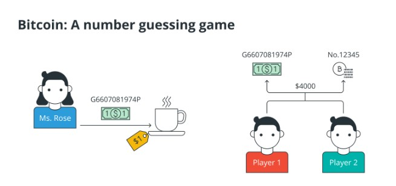
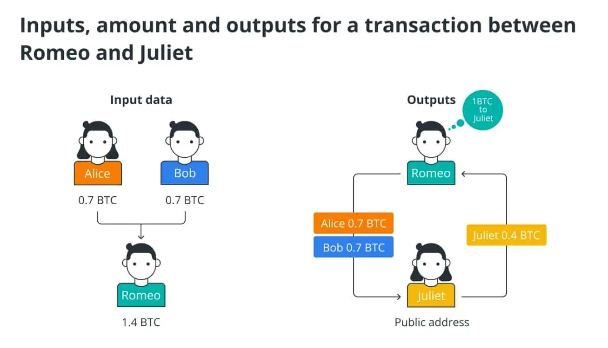
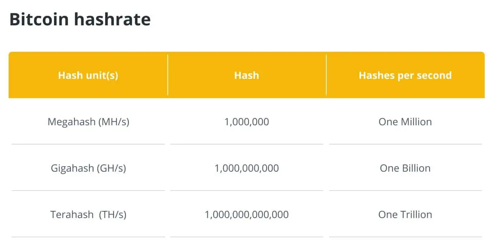
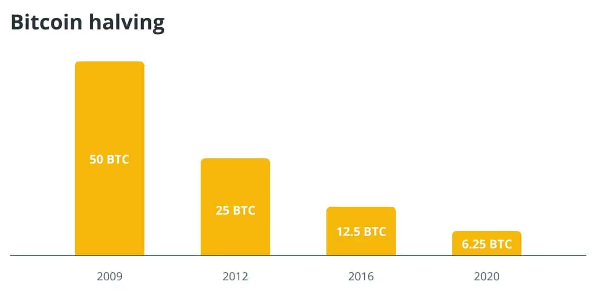
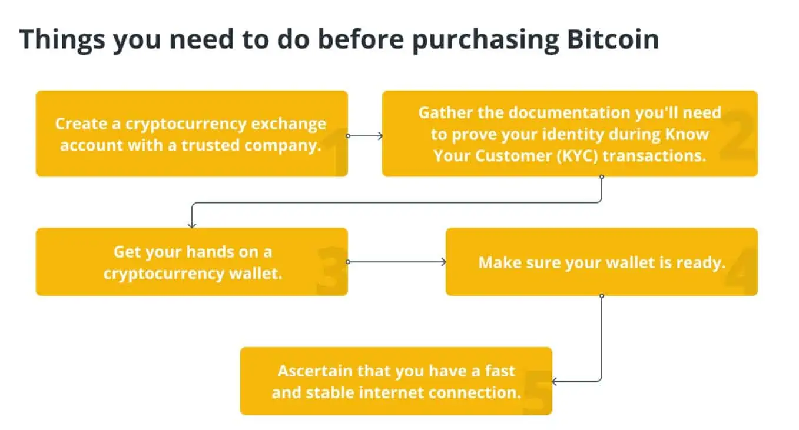

## Định nghĩa bitcoin: Trò chơi đoán số

[Sách trắng](https://bitcoin.org/bitcoin.pdf) đã mô tả Bitcoin ( [BTC](https://bitcoin.org/) ) là một “hệ thống tiền mặt điện tử ngang hàng” mà không có cơ quan trung ương hoặc ngân hàng nào; quản lý các giao dịch và phát hành bitcoin được thực hiện chung bởi mạng. Nhưng, Bitcoin đến từ đâu?

Theo các thuật toán, Bitcoin mới được tạo ra và trao cho những người dùng máy tính giải quyết các thách thức toán học được chỉ định trước. Các vấn đề toán học đề cập đến một hàm băm, là một số thập lục phân có 64 chữ số nhỏ hơn hoặc bằng hàm băm mục tiêu. Vì vậy, Bitcoin chỉ đơn giản là một con số, chẳng hạn như 12345.

Để minh họa, giả sử cô Rose rút tờ 1 đô la từ ví của mình có số G5552581974P. Không có hóa đơn nào khác mang số G5552581974P, vì Hệ thống Dự trữ Liên bang (ở Hoa Kỳ) hoạt động ở mức độ thẩm quyền tối thiểu.

Vì số tiền này có mệnh giá 1 đô la nên cô Rose có thể dùng nó để mua một tách cà phê.

Bây giờ, giả sử có hai người đồng ý rằng hóa đơn G5552581974P thực sự trị giá 4.000 đô la. Sự khác biệt duy nhất giữa Bitcoin số 12345 và tờ 1 đô la số G5552581974P là tờ 1 đô la có sự tồn tại vật chất và mệnh giá có giá trị gì đó. Mặt khác, Bitcoin không có giá trị nội tại và chỉ đơn giản là một con số. Con số có thể có một giá trị được hai người đồng ý, nhưng bản thân nó không có giá trị gì. Do đó, Bitcoin được tạo ra bởi một nhóm các cá nhân chơi trò chơi đoán số.

Vì vậy, điểm đầu tiên của việc chơi trò chơi này là gì? Trò chơi rất quan trọng vì nó là một kỹ thuật hỗ trợ xác minh và bảo mật lịch sử giao dịch của mạng Bitcoin. Bất kỳ ai muốn đóng góp các giao dịch mới cho mạng trước tiên phải chơi và thắng một trò chơi, trò chơi này cần sức mạnh tính toán. Do đó, kẻ tấn công sẽ gặp khó khăn và tốn kém khi gây ra bất kỳ thiệt hại nào cho mạng.

## Bitcoin được hỗ trợ bởi cái gì và Bitcoin hoạt động như thế nào?

Không giống như các loại tiền tệ truyền thống, Bitcoin không được phát hành bởi ngân hàng trung ương cũng như không được chính phủ hỗ trợ. Do đó, tỷ lệ lạm phát, chính sách tiền tệ và các chỉ số tăng trưởng kinh tế có ảnh hưởng truyền thống đến giá trị tiền tệ không áp dụng cho Bitcoin.

Bitcoin dựa trên một chuỗi khối, là một sổ cái kỹ thuật số phân tán. Chuỗi khối là một khối dữ liệu được liên kết tạo thành từ các đơn vị được gọi là khối chứa thông tin về từng giao dịch, chẳng hạn như người mua và người bán, thời gian và ngày tháng, tổng giá trị và mã nhận dạng duy nhất cho mỗi trao đổi. Các mục được kết nối theo trình tự thời gian, tạo thành một chuỗi khối kỹ thuật số.

Khi một khối được tải lên chuỗi khối, nó sẽ có sẵn cho bất kỳ ai xem nó, do đó hoạt động như một bản ghi công khai cho các giao dịch tiền điện tử. Chuỗi khối được phân cấp, có nghĩa là một thực thể duy nhất không kiểm soát nó. Chuỗi khối kỹ thuật số tương tự như Google Tài liệu mà bất kỳ ai cũng có thể chỉnh sửa. Nó không thuộc sở hữu của bất kỳ ai, nhưng bất kỳ ai có liên kết đều có thể đóng góp cho nó. Khi các cá nhân khác nhau thay đổi nó, bản sao của bạn cũng được cập nhật.

Mặc dù ý tưởng về việc mọi người đều có thể chỉnh sửa chuỗi khối có vẻ không an toàn, nhưng đó chính xác là điều khiến Bitcoin trở nên đáng tin cậy và an toàn. Để được đưa vào chuỗi khối Bitcoin, một khối giao dịch phải được xác thực bởi phần lớn các công cụ khai thác Bitcoin.

Các mã duy nhất được sử dụng để xác định ví và giao dịch của người dùng phải tuân theo mẫu mã hóa chính xác. Vì các mã duy nhất này là các số ngẫu nhiên dài nên việc làm giả chúng là vô cùng khó khăn. Tính ngẫu nhiên thống kê của mã xác minh chuỗi khối cần thiết cho mỗi giao dịch giảm thiểu đáng kể khả năng giao dịch Bitcoin gian lận được thực hiện bởi bất kỳ ai kết nối với mạng.

## Tại sao Bitcoin được tạo ra?

Trong thế kỷ 19 và 20, nhiều loại tiền tệ phổ biến nhất trên thế giới đã được chuyển đổi thành một lượng vàng cố định hoặc các kim loại quý khác. Tuy nhiên, hầu hết các quốc gia đã từ bỏ bản vị vàng từ những năm 1920 đến những năm 1970, một phần do căng thẳng tài trợ cho hai cuộc chiến tranh thế giới và việc sản xuất vàng toàn cầu không thể theo kịp sự phát triển kinh tế.

Hơn nữa, các vật có giá trị vật chất như vàng và bạc trước đây được giao dịch để lấy hàng hóa và dịch vụ. Tuy nhiên, vì tài sản vật chất rất cồng kềnh và dễ bị mất mát và trộm cắp nên các ngân hàng đã giữ lại chúng cho người dùng, tạo ra các ghi chú xác nhận tài sản ngân hàng của người dùng.

Người dùng dựa vào ngân hàng để duy trì giá trị đồng tiền của họ và bảo vệ tiền của họ. Tuy nhiên, từ năm 2008 đến 2009, một số ngân hàng và các tổ chức tài chính khác đã phá sản trên toàn thế giới và các chính phủ phải cứu trợ họ bằng chi phí của người nộp thuế.

Sự thất bại của các ngân hàng (với tư cách là người bảo vệ các quỹ công) cho thấy hệ thống tài chính hiện đại có thể mong manh như thế nào và nhu cầu phân cấp các dịch vụ tài chính để nâng cao trải nghiệm của khách hàng. Do đó, Bitcoin được coi là một phản ứng đối với cuộc Đại khủng hoảng tài chính và sự phụ thuộc của thế giới tài chính vào các ngân hàng với tư cách là trung gian giao dịch tài chính.

Satoshi Nakamoto có ý tưởng loại bỏ ngân hàng khỏi các giao dịch tài chính và thay thế chúng bằng hệ thống thanh toán ngang hàng (P2P) không yêu cầu xác nhận của bên thứ ba, loại bỏ nhu cầu ngân hàng hỗ trợ mọi giao dịch. Chuỗi khối, sổ cái dựa trên mạng, là cách Bitcoin và các loại tiền điện tử khác phát triển niềm tin. Vậy, Bitcoin được tạo ra khi nào?

Khi khối đầu tiên, được gọi là khối genesis, được khai thác vào ngày 3 tháng 1 năm 2009, chuỗi khối đã chính thức ra mắt. Một tuần sau, giao dịch thử nghiệm đầu tiên diễn ra. Chuỗi khối Bitcoin chỉ khả dụng cho những người khai thác xác nhận các giao dịch Bitcoin trong vài tháng đầu tiên kể từ khi nó tồn tại.

Bitcoin không có giá trị tiền tệ thực sự vào thời điểm này. Công cụ khai thác — những cỗ máy giải các bài toán phức tạp để khám phá Bitcoin mới và xác minh rằng các giao dịch Bitcoin hiện có là hợp lệ và chính xác — sẽ trao đổi Bitcoin để giải trí.

Giao dịch kinh tế đầu tiên mất hơn một năm để hoàn thành, khi một người đàn ông ở Florida đồng ý giao hai chiếc pizza Papa John's trị giá 25 đô la với giá 10.000 Bitcoin vào ngày 22 tháng 5 năm 2010. Ngày này đã được tổ chức là Ngày Pizza Bitcoin kể từ đó.

Giá hoặc giá trị trong thế giới thực ban đầu của Bitcoin được đặt ở mức 4 BTC mỗi xu do giao dịch này. Quản lý chuỗi cung ứng, lập kế hoạch nguồn lực giữa các doanh nghiệp, hậu cần, giao dịch năng lượng, DAO hoặc các tổ chức tự trị phi tập trung và nhiều ứng dụng khác hiện đang được khám phá bằng Bitcoin.

## Bitcoin được tạo ra khi nào?

Bitcoin được tạo ra sau cuộc khủng hoảng tài chính năm 2008 thông qua một sách trắng được viết bởi một thực thể hoặc một nhóm người có tên giả là Satoshi Nakamoto. Cuộc khủng hoảng đóng vai trò là động lực mạnh mẽ cho sự phát triển của Bitcoin. Hướng dẫn này nhằm mục đích cung cấp một cái nhìn thoáng qua về Bitcoin đã tồn tại được bao lâu, ai đã bắt đầu Bitcoin và Bitcoin được sử dụng để làm gì?

Cuộc khủng hoảng tài chính năm 2007 và 2008 — thường được gọi là cuộc khủng hoảng thế chấp dưới chuẩn — là một sự kiện toàn cầu dẫn đến sự sụt giảm đáng kể thanh khoản trên thị trường tài chính toàn cầu (bắt đầu ở Hoa Kỳ) do sự sụp đổ của thị trường nhà đất.

Khi thế giới chìm trong suy thoái kinh tế toàn cầu do đầu cơ quá mức trên thị trường tài chính và các ngân hàng mạo hiểm hàng triệu đô la tiền gửi, sách trắng đã đặt nền móng cho tiền kỹ thuật số đầy đủ chức năng đầu tiên dựa trên công nghệ sổ cái phân tán (DLT) được gọi là chuỗi khối. Vậy, Bitcoin là gì và nó hoạt động như thế nào?

Sách trắng Bitcoin là tài liệu đầu tiên đưa ra các nguyên tắc cơ bản của hệ thống thanh toán điện tử ngang hàng (P2P) an toàn bằng mật mã được thiết kế cơ bản để chống kiểm duyệt và minh bạch, đồng thời đòi lại quyền lực tài chính cho các cá nhân.

Bitcoin là tiền kỹ thuật số, còn được gọi là tiền điện tử, hoạt động độc lập với bất kỳ cơ quan trung ương nào. Tiền điện tử là một phương tiện trao đổi kỹ thuật số giúp bảo mật và xác minh các giao dịch bằng cách sử dụng mã hóa. Mã hóa đề cập đến một phương pháp chuyển đổi văn bản thuần túy thành một văn bản ngẫu nhiên hoặc vô nghĩa được gọi là bản mã. Nghiên cứu về các kỹ thuật liên lạc an toàn chỉ cho phép người gửi và người nhận tin nhắn dự định đọc nội dung của nó được gọi là mật mã.

Bitcoin được tạo ra như một giải pháp thay thế cho các loại tiền tệ fiat hiện có mà cuối cùng có thể được công nhận là tiền tệ toàn cầu. Ngày nay, các loại tiền pháp định như bảng Anh và đô la Mỹ là những loại tiền được sử dụng rộng rãi nhất trên toàn cầu. Tiền tệ Fiat được kiểm soát bởi một chính phủ quốc gia về mặt cung cấp và tạo ra và được hỗ trợ bởi sự tin tưởng và tin tưởng vào chính phủ đó.

Tuy nhiên, Bitcoin sử dụng công nghệ ngang hàng để tạo điều kiện thuận lợi cho các giao dịch giữa các bên tin rằng tài sản được chuyển giao có giá trị nội tại. P2P đề cập đến việc trao đổi trực tiếp một tài sản, như Bitcoin, giữa các cá nhân mà không có sự can thiệp của cơ quan trung ương.

## Bitcoin được tạo ra từ đâu: Khóa công khai và khóa riêng trong Bitcoin

Về cơ bản nhất, Bitcoin là một hệ thống mật mã khóa công khai tự động, tạo điều kiện thuận lợi cho việc trao đổi giá trị kỹ thuật số giữa các mạng ngang hàng thông qua một chuỗi các giao dịch được ký kỹ thuật số, thay vì tin nhắn. Luồng quy trình cơ bản của giao dịch Bitcoin giống hệt với quy trình của một loạt thông điệp được mã hóa được tìm thấy trong sơ đồ mật mã khóa công khai và chữ ký số.

Để bảo vệ dữ liệu khỏi bị truy cập hoặc sử dụng trái phép, mật mã khóa công khai sử dụng một cặp khóa để mã hóa và giải mã dữ liệu. Chữ ký số là chữ ký điện tử sử dụng thuật toán toán học để xác minh tính hợp lệ và tính toàn vẹn của thông điệp kỹ thuật số. Do đó, Bitcoin là một chuỗi chữ ký số.

Mỗi chủ sở hữu gửi Bitcoin cho người tiếp theo bằng cách ký điện tử một hàm băm của giao dịch trước đó và khóa công khai của chủ sở hữu tiếp theo, sau đó nối chúng vào phần cuối của đồng xu. Chuỗi quyền sở hữu có thể được xác nhận bởi người nhận thanh toán bằng cách xác minh chữ ký.

Người dùng phải có quyền truy cập vào khóa công khai và khóa riêng được liên kết để chuyển số lượng Bitcoin cần thiết. Khi đề cập đến một người sở hữu Bitcoin, điều đó thực sự có nghĩa là họ có quyền truy cập vào một cặp khóa bao gồm khóa công khai và khóa riêng tư.

Khóa công khai đề cập đến một địa chỉ mà một số Bitcoin đã được truyền trước đó. Khóa riêng duy nhất đi kèm (mật khẩu) cho phép Bitcoin được gửi đi nơi khác sau khi được gửi đến khóa chung (địa chỉ) ở trên.

Địa chỉ bitcoin, còn được gọi là khóa công khai, là chuỗi các chữ cái và số được tạo ngẫu nhiên hoạt động tương tự như địa chỉ email hoặc tên người dùng trên trang mạng xã hội. Chúng được công khai, đúng như tên gọi của nó, vì vậy người dùng có thể chia sẻ chúng với những người khác một cách an toàn. Trên thực tế, nếu người dùng muốn bất kỳ ai gửi Bitcoin cho họ, họ phải cung cấp cho họ địa chỉ Bitcoin của họ.

Khóa riêng được tạo thành từ một tập hợp các chữ cái và số khác nhau được tạo ngẫu nhiên. Khóa cá nhân phải được giữ bí mật, giống như mật khẩu cho email hoặc các dịch vụ khác. Không bao giờ đưa khóa riêng của bạn cho người mà bạn không hoàn toàn tin tưởng để họ không lấy cắp của bạn.

Một địa chỉ Bitcoin có thể được so sánh với một két an toàn minh bạch. Những người khác có thể nhìn thấy những gì bên trong, nhưng chỉ chủ sở hữu khóa cá nhân mới có thể mở két và lấy tiền.

### Đầu vào và đầu ra giao dịch

Mặc dù có thể xử lý các đồng tiền riêng lẻ, nhưng việc thực hiện một giao dịch riêng cho từng đồng xu trong một lần chuyển khoản sẽ rất bất tiện. Các giao dịch có nhiều đầu vào và đầu ra để cho phép giá trị được phân chia và hợp nhất.

Thông thường, sẽ có một đầu vào duy nhất từ ​​một giao dịch quan trọng hơn trước đó hoặc nhiều đầu vào kết hợp số tiền ít hơn với tối đa hai đầu ra: một cho khoản thanh toán và một để trả lại bất kỳ thay đổi nào cho người gửi.

Bây giờ, hãy tưởng tượng rằng Romeo muốn gửi cho Juliet 1 BTC. Anh ta hoàn thành việc này bằng cách ký một thông báo chứa thông tin cụ thể về giao dịch bằng khóa riêng của mình. Nội dung sau đây sẽ được bao gồm trong thông báo này phải được phát tới mạng:

Đầu vào: Đầu vào chứa thông tin chi tiết về Bitcoin đã được gửi đến địa chỉ của Romeo trước đó. Hãy xem xét trường hợp Romeo nhận được 0,7 BTC từ Alice và 0,7 BTC từ Bob. Bây giờ, để truyền 1 BTC cho Juliet, có thể có hai đầu vào: một đầu vào 0,7 BTC từ Alice và một đầu vào 0,7 BTC từ Bob.

Số tiền: Số tiền Romeo muốn gửi là 1 BTC.

Đầu ra: Đầu ra ban đầu là 1,4 BTC đến địa chỉ công khai của Juliet (0,7 BTC + 0,7 BTC). Đầu ra thứ hai là 0,4 BTC được trả lại cho Romeo dưới dạng “tiền lẻ”.

### Phát sóng và xác nhận qua mạng

Romeo sẽ phát giao dịch dự định của mình tới mạng Bitcoin thông qua phần mềm ví của anh ấy trong ví dụ trên. Dữ liệu đầu vào (nghĩa là (các) địa chỉ mà Romeo đã nhận được Bitcoin trước đó mà anh ta tuyên bố sở hữu) được xác minh bởi một nhóm thành viên mạng cụ thể được gọi là “thợ đào”.

Những người khai thác cũng tạo ra một khối bằng cách kết hợp một danh sách các giao dịch bổ sung được phát lên mạng cùng thời điểm với Mark. Bất kỳ người khai thác nào đã hoàn thành bằng chứng công việc (Proof Of Stake) hoặc PoW đều có thể đề xuất thêm một khối mới vào chuỗi hoặc “kết nối” với nó bằng cách tham chiếu khối trước đó. Mạng sau đó được thông báo về khối mới.

Những người tham gia mạng khác (các nút) sẽ chuyển tiếp nếu họ đồng ý rằng đó là một khối hợp lệ (nghĩa là các giao dịch trong đó đáp ứng tất cả các yêu cầu giao thức và tham chiếu đầy đủ khối trước đó). Khi đề xuất khối tiếp theo, một công cụ khai thác khác cuối cùng sẽ xây dựng trên khối đó bằng cách coi khối đó là khối trước đó. Công cụ khai thác tiếp theo sẽ “xác minh” bất kỳ giao dịch nào được thêm vào khối cuối cùng. Số lượng xác nhận cho giao dịch của Romeo tăng lên khi các khối được thêm vào chuỗi.

## Khai thác Bitcoin là gì và nó hoạt động như thế nào?

Quá trình thêm các giao dịch mới vào chuỗi khối Bitcoin được gọi là khai thác Bitcoin. Đó là một công việc khó khăn. Công cụ khai thác bitcoin sử dụng kỹ thuật PoW, trong đó các máy tính cạnh tranh để giải các bài toán xác thực giao dịch.

Nói chung, những người khai thác cố gắng tạo ra một số thập lục phân gồm 64 chữ số, được gọi là hàm băm, nhỏ hơn hoặc bằng hàm băm mục tiêu. Tỷ lệ băm bitcoin cho biết số lượng băm ước tính được tạo bởi những người khai thác đang cố gắng giải quyết khối Bitcoin hiện tại hoặc bất kỳ khối cụ thể nào.

Tỷ lệ băm của Bitcoin được đo bằng Số băm trên giây hoặc H/s. Công cụ khai thác cần tốc độ băm cao, được đo bằng megahash mỗi giây (MH/s), gigahash mỗi giây (GH/s) và terahash mỗi giây (TH/s), để khai thác thành công.

Mã Bitcoin thưởng cho những người khai thác thêm Bitcoin để khuyến khích họ tiếp tục chạy đua để giải các câu đố và duy trì toàn bộ hệ thống. Đây là cách các giao dịch blockchain mới được thêm vào hệ thống.

Điều quan trọng cần lưu ý là tỷ lệ băm Bitcoin không ảnh hưởng đến tốc độ giải quyết mỗi khối. Giá trị độ khó khai thác Bitcoin (được điều chỉnh tăng hoặc giảm ở mỗi khối) đảm bảo các khối được giải quyết tại một khung thời gian cố định được gọi là thời gian khối.

Việc khai thác bitcoin mang lại lợi nhuận thấp hơn đáng kể so với trước đây, khiến việc bù đắp chi phí gia tăng liên quan đến việc mua sức mạnh tính toán và vận hành nó bằng cách sử dụng hết điện trở nên khó khăn hơn.

Khi hệ thống này được giới thiệu lần đầu tiên vào năm 2009, những người khai thác đã nhận được một stamp mỗi khi họ nhận được số lượng Bitcoin cao hơn hiện tại. Phần thưởng khối giảm một nửa sau mỗi 210.000 khối (khoảng bốn năm một lần).

Chẳng hạn, một khối Bitcoin trị giá 50 BTC khi nó được khai thác lần đầu vào năm 2009. Con số này đã giảm xuống còn 25 BTC vào năm 2012. Đến năm 2016, nó lại bị cắt giảm một nửa xuống còn 12,5 BTC. Phần thưởng lại được giảm vào ngày 11 tháng 5 năm 2020 xuống còn 6,25 BTC.

Khi số lượng giao dịch tăng lên, số tiền mà những người khai thác được trả cho mỗi giao dịch sẽ giảm xuống. Đến năm 2140, dự kiến ​​tất cả Bitcoin sẽ được đưa vào lưu thông, khiến những người khai thác không còn lựa chọn nào khác ngoài việc dựa vào phí giao dịch để kiếm lợi nhuận từ việc xác thực mạng.

## Ví Bitcoin là gì và nó hoạt động như thế nào?

Ví Bitcoin là ví kỹ thuật số có thể lưu trữ Bitcoin và các loại tiền điện tử khác như Ethereum (ETH). Ví Bitcoin (hoặc bất kỳ ví tiền điện tử nào) là ví kỹ thuật số lưu trữ khóa mã hóa cấp quyền truy cập vào địa chỉ công khai BTC và cho phép giao dịch. Có năm loại ví Bitcoin : di động, web, máy tính để bàn, phần cứng và giấy.

Ví bitcoin không chỉ lưu trữ tiền kỹ thuật số của bạn mà còn bảo vệ chúng bằng khóa riêng tư duy nhất mà chỉ bạn và bất kỳ ai khác mà bạn cung cấp mã mới có thể truy cập. Ví tiền điện tử cho phép bạn lưu trữ, gửi và nhận nhiều loại tiền và mã thông báo khác nhau. Một số xử lý các giao dịch cơ bản, trong khi một số khác bao gồm quyền truy cập tích hợp vào các ứng dụng phi tập trung dựa trên chuỗi khối hoặc DApps.

Khi bạn tạo ví Bitcoin, bạn sẽ được cấp một khóa riêng và một khóa chung được liên kết với ví của bạn. Khi bạn tạo ví Bitcoin, bạn sẽ được cấp một khóa riêng và một khóa chung được liên kết với ví của bạn.

Khóa công khai có thể so sánh với địa chỉ email ở chỗ nó có thể được chia sẻ với bất kỳ ai. Khi ví của bạn được tạo, một khóa công khai sẽ được tạo mà bạn có thể chia sẻ với bất kỳ ai để nhận tiền.

Khóa riêng là một bí mật được bảo vệ chặt chẽ. Nó tương tự như mật khẩu của bạn ở chỗ nó không bị hack và không được chia sẻ với bất kỳ ai. Thay vào đó, bạn tiêu tiền của mình bằng khóa riêng này. Nếu ai đó có được quyền truy cập vào khóa riêng tư của bạn, rất có thể tài khoản của bạn sẽ bị hack và bạn sẽ mất tất cả tiền gửi bằng tiền điện tử của mình.

## Trao đổi Bitcoin là gì và làm thế nào để mua và bán Bitcoin?

Trao đổi Bitcoin là một thị trường kỹ thuật số nơi các nhà giao dịch có thể mua và bán BTC bằng nhiều loại tiền tệ fiat và tiền thay thế khác nhau. Trao đổi tiền tệ Bitcoin là một nền tảng trực tuyến hoạt động như một người trung gian giữa người mua và người bán BTC.

Người giao dịch có thể mua và bán Bitcoin bằng cách sử dụng lệnh thị trường hoặc lệnh giới hạn , giống như trên một sàn giao dịch chứng khoán thông thường. Đối với giao dịch Bitcoin trên một sàn giao dịch, trước tiên người dùng phải đăng ký với sàn giao dịch và sau đó trải qua một số quy trình xác minh danh tính. Sau khi xác thực thành công, tài khoản của người dùng được tạo và họ phải nạp tiền vào đó trước khi có thể mua hoặc bán BTC.

Tuy nhiên, có một số điều bạn cần làm trước khi tìm hiểu sâu hơn về cách đầu tư vào Bitcoin. Đây là một số trong số họ:

## Bitcoin ẩn danh như thế nào?

Bitcoin thường được gọi là “ẩn danh” vì nó có thể được gửi và nhận mà không tiết lộ bất kỳ thông tin nhận dạng cá nhân nào. Tuy nhiên, việc ẩn danh hợp lý với BTC có thể khó khăn và ẩn danh hoàn toàn có thể không đạt được.

Gửi và nhận Bitcoin tương tự như viết ẩn danh. Nếu bút danh của một tác giả từng được liên kết với danh tính của họ, thì mọi thứ họ từng viết dưới tên đó cũng sẽ được liên kết với họ.

Bút danh của bạn là địa chỉ mà bạn nhận Bitcoin bằng Bitcoin. Mọi giao dịch liên quan đến địa chỉ đều được ghi lại trong chuỗi khối mọi lúc. Mọi giao dịch sẽ được liên kết với bạn nếu địa chỉ của bạn khớp với danh tính của bạn. Do đó, Bitcoin là bút danh chứ không phải ẩn danh.

## Ưu điểm và nhược điểm của Bitcoin

### Ưu điểm của Bitcoin

Không có chính phủ nào kiểm soát mạng Bitcoin. Mỗi người chơi tham gia vào mạng Bitcoin sẽ tự động đảm bảo hoạt động của giao thức. Người dùng bitcoin có quyền kiểm soát thông tin cá nhân và dữ liệu tài chính của họ nhiều hơn đáng kể so với người dùng tiền tệ fiat và các hình thức thanh toán kỹ thuật số khác như thẻ tín dụng, so với cơ sở hạ tầng tài chính truyền thống. Họ cũng đối mặt với ít rủi ro bị đánh cắp danh tính hơn so với người dùng tiền tệ fiat và các hình thức thanh toán kỹ thuật số khác như thẻ tín dụng.

Khi những kẻ lừa đảo có quyền truy cập vào đủ thông tin về danh tính của một người, chẳng hạn như tên, địa chỉ hiện tại hoặc trước đây hoặc ngày sinh, chúng sẽ thực hiện hành vi trộm cắp danh tính. Nguy cơ bị đánh cắp danh tính trong khi sử dụng tiền điện tử thấp do các khóa riêng bằng mật mã, ẩn danh tính của người dùng đằng sau địa chỉ ví Bitcoin có thể xem công khai.

Tỷ lệ băm mạng của Bitcoin, là thước đo sức mạnh tổng hợp của máy tính liên quan đến việc xác thực các giao dịch trên chuỗi khối Bitcoin tại bất kỳ thời điểm nào, liên tục phá vỡ các kỷ lục.

Rất may, an ninh mạng lớn hơn đã được thiết lập khi chuỗi khối Bitcoin trở nên linh hoạt hơn trước khả năng bị tấn công 51%, đảm bảo rằng sự thật được chia sẻ của sổ cái chuỗi khối được bảo vệ, nhưng mối đe dọa của cuộc tấn công 51% luôn có thể xảy ra. Khi một hoặc nhiều công cụ khai thác giành quyền kiểm soát hơn 50% công suất khai thác, sức mạnh tính toán hoặc tỷ lệ băm của mạng, thì một cuộc tấn công 51% sẽ xảy ra. Nếu thành công, những người khai thác phụ trách sẽ kiểm soát hiệu quả mạng và một số giao dịch trên đó.

Một cuộc tấn công 51% sẽ cho phép những người khai thác ngăn chặn các giao dịch mới được ghi lại, cấm các giao dịch được xác thực hoặc hoàn thành, thay đổi thứ tự giao dịch, hạn chế những người khai thác khác khai thác tiền hoặc mã thông báo trong mạng và đảo ngược giao dịch thành tiền chi tiêu gấp đôi.

Ví dụ, một tình huống chi tiêu gấp đôi sẽ cho phép những người khai thác thanh toán cho một thứ gì đó bằng tiền điện tử và sau đó đảo ngược giao dịch sau đó. Điều đó có nghĩa là những người khai thác giữ lại bất cứ thứ gì họ đã mua, cũng như tiền điện tử được sử dụng trong giao dịch, do đó lừa người bán. Tuy nhiên, khi một chuỗi khối phát triển về kích thước, thì việc tấn công nó trở nên khó khăn hơn đối với những kẻ khai thác lừa đảo. Mặt khác, các mạng nhỏ hơn có thể dễ bị tấn công hơn.

### Nhược điểm của Bitcoin

Các chính phủ có thể cố gắng hạn chế, điều chỉnh hoặc đặt ngoài vòng pháp luật việc sử dụng và bán Bitcoin, như một số khu vực pháp lý đã thực hiện trước đây. Hơn nữa, sự biến động của Bitcoin luôn được cập nhật, đây là lý do quan trọng khiến nhiều nhà giao dịch tránh chấp nhận Bitcoin như một hình thức thanh toán vì họ sợ giá giảm. Thật không may, Bitcoin vẫn đang được sử dụng để thanh toán cho các hoạt động bất hợp pháp và rửa tiền. Mặt khác, các cơ quan bí mật trên khắp thế giới đang tăng cường khả năng an ninh mạng và chống tội phạm tiền điện tử.

Tính không thể đảo ngược của các giao dịch Bitcoin không phải lúc nào cũng là một điều tốt. Trong trường hợp bị tấn công, giao dịch bị hỏng hoặc trao đổi sản phẩm gian lận, nó có thể nhanh chóng trở thành một vấn đề lớn.

Theo một nguyên tắc cơ bản của tài chính hiện đại, bất cứ thứ gì điện tử đều phải đảo ngược được. Nếu Bitcoin thực sự là internet được áp dụng cho tiền, thì nó cũng nên có nút “quay lại”. Chỉ có thể ngăn chặn gian lận mà không có nút hoàn tác/quay lại. Tuy nhiên, gian lận có thể được phát hiện và giảm thiểu bằng tùy chọn hoàn tác khi nhận thấy có điều gì đó đáng ngờ đã xảy ra và khắc phục.

Ngược lại, trong trường hợp đánh cắp BTC, kẻ trộm cần khóa riêng để lấy số Bitcoin trị giá hàng triệu đô la từ một công ty. Vì việc chuyển số dư BTC là không thể đảo ngược, vì không có cách nào để lấy lại nếu tin tặc đánh cắp Bitcoin. Ngoài ra, mật khẩu của ví Bitcoin không thể khôi phục được — nếu người dùng quên mật khẩu, số tiền trong ví của anh ta sẽ vô giá trị.

## Tương lai của Bitcoin

Mười năm tới có thể rất quan trọng đối với sự phát triển của Bitcoin. Bên cạnh các cuộc cách mạng tài chính, có một vài khía cạnh của môi trường Bitcoin mà các nhà đầu tư nên đặc biệt chú ý. Hiện tại, tiền điện tử đang bị giằng xé giữa việc trở thành kho lưu trữ giá trị và phương tiện giao dịch.

Mặc dù các chính phủ trên toàn thế giới như Nhật Bản đã công nhận nó là một phương tiện thanh toán khả thi cho hàng hóa, nhưng các nhà đầu tư tổ chức vẫn muốn tham gia vào hành động này và kiếm lợi nhuận từ sự biến động trong giá cả của nó.

Tuy nhiên, các vấn đề về quy mô và bảo mật đã ngăn cả hai sự kiện trở thành một phương tiện trao đổi hoàn hảo. Ngoài ra, những lo ngại về bảo mật, lưu ký và hiệu quả vốn vẫn là một thách thức cần được giải quyết.

