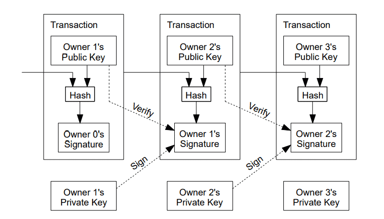
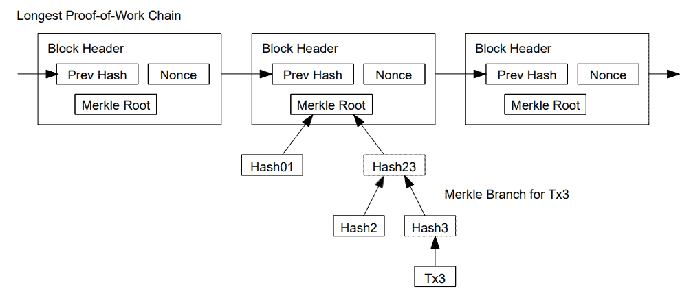

## Bitcoin: hệ thống tiền mặt điện tử mạng ngang hàng

```
Satoshi Nakamoto
satoshin@gmx.com
http://www.bitcoin.org
```

```
Translated into Vietnamese from bitcoin.org/bitcoin.pdf
by @pcdinh
```

> **Tóm lược**. Một dạng tiền mặt điện tử thuần túy trên mạng ngang hàng sẽ cho phép các khoản thanh toán trực tuyến được gửi đi trực tiếp từ một bên sang bên kia mà không đi qua một định chế tài chính nào. Các chữ ký số là một phần của giải pháp nhưng chúng ta buộc phải hi sinh những lợi ích chính nếu như vẫn phải cần đến một bên thứ ba được tin cậy để ngăn chặn việc trùng chi (ND1). Chúng tôi đề xuất một giải pháp cho vấn đề trùng chi này bằng cách sử dụng một mạng ngang hàng. Mạng này ghi nhãn thời gian lên các giao dịch bằng cách băm chúng thành một chuỗi nối liên tục các chứng cứ xử lý (ND2) dựa trên xâu kí tự băm, tạo nên một bản ghi mà không thể thay đổi nếu như không tạo lại chứng cứ xử lý. Chuỗi nối dài nhất không chỉ đóng vai trò như là chứng cứ về một dãy tuần tự các sự kiện ghi nhận được mà còn chứng nhận rằng nó đến từ nhóm lớn nhất về sức mạnh tính toán bằng CPU. Chừng nào mà phần lớn sức mạnh tính toán bằng CPU được kiểm soát bởi các nút
mạng không liên kết với nhau để tấn công toàn mạng, thì các nút này sẽ tạo ra chuỗi nối dài nhất và áp đảo các kẻ tấn công. Mạng này bản thân nó chỉ cần một cấu trúc tối thiểu. Các thông tin trao đổi được phát tán dựa trên khả năng phù hợp nhất có thể, và các nút có thể thoát và tham gia lại mạng tùy ý và chấp nhận liên kết chứng cứ xử lý dài nhất như là bằng chứng cho những gì đã xảy ra khi họ không ở trong mạng.

##  1. Giới Thiệu

Thương mại trên mạng Internet ngày càng trở nên phụ thuộc gần như hoàn toàn vào các định chế tài chính vốn đóng vai trò như là các bên thứ ba được tin cậy để xử lý các khoản thanh toán điện tử. Trong khi hệ thống này đáp ứng tốt cho phần lớn các giao dịch thì nó vẫn gặp phải một số yếu điểm cố hữu của mô hình dựa vào niềm tin. Các giao dịch hoàn toàn không thể đảo ngược thực sự là không thực hiện được bởi vì các định chế tài chính không thể nào né tránh việc tham gia vào hòa giải các tranh cãi. Chi phí của việc hòa giải làm tăng chi phí giao dịch, giới hạn giá trị giao dịch nhỏ nhất trên thực tế và loại bỏ khả năng thực hiện các giao dịch nhỏ thường thấy, và thực tế là còn mất nhiều chi phí hơn khi không có khả năng thực hiện các khoản thanh toán không thể đảo ngược đối với các dịch vụ không thể đảo ngược. Để có khả năng đảo ngược giao dịch, cái
cần phải có là niềm tin đủ lớn. Các hãng cung cấp phải tỏ ra cẩn trọng trước các khách hàng của họ, gây phiền hà cho khách hàng khi đòi hỏi nhiều thông tin hơn mức cần thiết. Việc phải chấp nhận một tỉ lệ phần trăm nhất định về gian lận là không thể tránh khỏi. Các chi phí và những sự việc không lường trước được trong thanh toán này có thể tránh được thông qua việc cá nhân sử dụng loại tiền cầm nắm được, nhưng lại không tồn tại một cơ chế nào như vậy khi thanh toán qua một kênh truyền thông mà không thông qua một bên được tin cậy. Thứ chúng ta cần ở đây là một hệ thống thanh toán điện tử dựa trên chứng cứ mật mã thay vì niềm tin, cho phép hai bên sẵn sàng tham gia tiến hành giao dịch trực tiếp với nhau mà không cần phải có một bên thứ ba được tin cậy. Các giao dịch mà về mặt số lượng tính toán là không thực tế nếu muốn đảo ngược sẽ bảo vệ những người bán trước các gian lận và các cơ chế ký quỹ bảo lãnh thông dụng có thể dễ dạng được triển khai để bảo vệ người mua. Trong báo cáo này, chúng tôi đề xuất một giải pháp cho vấn đề trùng chi bằng cách sử dụng một ứng dụng máy chủ nhãn thời gian phân tán (ND3) trên mạng ngang hàng để tạo ra bằng chứng về mặt xử lý tính toán đối với trật tự
thời gian của các giao dịch. Hệ thống này an toàn chừng nào mà tập hợp các nút tuân thủ đúng luật kiểm soát nhiều sức mạnh tính toán trên CPU hơn nhóm các nút của các kẻ tấn công phối hợp với nhau.

## 2. Các giao dịch

Chúng tôi định nghĩa một loại tiền xu điện tử như là một chuỗi nối các chữ kí số. Mỗi một người chủ sở hữu chuyển đồng xu này sang người chủ tiếp theo bằng cách ghi chữ số vào một xâu băm của giao dịch trước đó và chìa khóa công khai của người chủ tiếp theo rồi đưa các kết quả này vào cuối của đồng xu. Người nhận tiền có thể kiểm tra các chữ kí để xác nhận chuỗi sở hữu.



Vấn đề của hướng xử lý này là ở chỗ người nhận tiền không thể kiểm tra để xác nhận rằng một trong các người chủ của số tiền gửi đi đã không cố tình trùng chi. Giải pháp thường thấy là cần đến một đại diện được tin cậy có thẩm quyền đứng ở giữa, hay còn gọi là trung tâm in tiền, kiểm tra từng giao dịch xem có dấu hiệu cố tình trùng chi không. Sau mỗi một giao dịch, đồng xu cần phải được trả lại cho trung tâm in tiền để phát hành đồng xu mới, và chỉ những đồng xu được phát hành trực tiếp từ trung tâm in tiền mới được tin cậy là không bị trùng chi. Vấn đề với giải pháp này là số phận của toàn bộ hệ thống tiền tệ phụ thuộc vào công ty vận hành trung tâm in tiền nơi tất cả các giao dịch phải đi qua đó, giống như ngân hàng. Chúng ta cần một cách thức để người nhận tiền biết rằng những người chủ trước đó của đồng xu đã không dùng nó trong bất cứ một giao dịch nào diễn ra trước đó. Để đáp ứng được mục đích của chúng ta, giao dịch diễn ra sớm nhất là giao dịch được tính, và do đó chúng ta không quan tâm đến các hành động diễn ra sau đó có liên quan đến việc cố tình tiêu đồng xu này làm nhiều
lần hay không. Cách duy nhất để xác nhận một giao dịch nào đó đã diễn ra chưa là phải biết trước tất cả các giao dịch. Trong mô hình dựa vào trung tâm in tiền, trung tâm này phải biết được tất cả các giao dịch và quyết định cái nào đến trước. Để thực hiện được điều này mà không cần thông qua một bên thứ ba được tin cậy, các giao dịch phải được công bố công khai [1], và chúng ta cần một hệ thống cho phép người tham gia chấp nhận một lịch sử duy nhất về trật tự các giao dịch mà
họ tham gia. Người nhận tiền cần chứng cứ rằng vào lúc diễn ra từng giao dịch, đa số các nút đã đồng ý rằng giao dịch đấy là giao dịch được tiến hành lần đầu tiên.

## 3. Ứng dụng máy chủ nhãn thời gian

Giải pháp mà chúng tôi đề xuất bắt đầu bằng một ứng dụng máy chủ nhãn thời gian. Một máy chủ nhãn thời gian hoạt động bằng cách sinh chuỗi băm cho một khối (ND7) các mục dữ liệu có ghi thời gian và công bố rộng rãi băm này như là trên báo hay bài trên Usenet [2-5]. Nhãn thời gian này chứng tỏ rằng dữ liệu phải tồn tại vào thời gian đó một cách hiển nhiên để được đưa vào băm. Mỗi nhãn thời gian lại tính nhãn thời gian trước đó vào băm của nó, từ đó tạo ra một chuỗi nối, mà ở đó mỗi nhãn thời gian bổ sung vào sau sẽ gia tăng sức nặng thêm cho các nhãn thời gian trước nó.


## 4. Chứng cứ xử lý

Để triển khai một ứng dụng máy chủ nhãn thời gian phân tán (ND3) trên cơ sở ngang hàng, chúng tôi sẽ cần sử dụng một hệ thống chứng cứ xử lý tương tự như Hashcash của Adam Back [6], chứ không phải là cơ chế giống như ở các bài viết trên báo hay trên Usenet. Chứng cứ xử lý tham gia vào việc dò tìm một giá trị mà khi một khi được băm, ví dụ như băm với SHA-256, thì băm đó bắt đầu bằng một số các bit 0. Lượng tính toán bình quân phải làm có quan hệ ở cấp số nhân với số các bit 0 phải có và có thể kiểm tra được bằng cách thực hiện chỉ một băm. 

Đối với mạng nhãn thời gian, chúng tôi triển khai chứng cứ xử lý bằng cách tăng dần một con số dùng một lần (ND4) trong khối đó cho đến khi tìm thấy một giá trị giúp tạo ra chuỗi băm của khối với các bit 0 theo yêu cầu. Một khi CPU được sử dụng để tính toán ra chứng cứ xử lý thì khối đó không thể nào thay đổi mà không tính toán lại chứng cứ xử lý này. Về sau, khi mà các khối khác nối với khối trên thì khối lượng tính toán để thay đổi khối đó sẽ bao gồm cả lượng tính toán trên các khối xuất hiện sau.


Chứng cứ xử lý cũng giải quyết cách xác định kết quả khi đưa ra quyết định dựa trên đa số. Nếu như trước đây nhóm đa số được xác định bằng 1-địa-chỉ-IP-là-một-phiếu, thì người ta có thể gian lận bằng cách dùng nhiều địa chỉ IP. Về bản chất chứng cứ xử lý chính là một-CPU-là-một-phiếu. Kết quả của quá trình quyết định dựa trên đa số được thể hiện thông qua chuỗi nối dài nhất, tức là chuỗi nối có nhiều số lượng tính toán chứng cứ xử lý nhất. Nếu phần lớn sức mạnh CPU được kiểm soát bởi các nút tuân thủ đúng quy tắc thì chuỗi nối tạo bởi các nút này sẽ trở thành chuỗi nối nhanh nhất và áp đảo các chuỗi nối cạnh tranh. Để thay đổi một khối trong quá khứ, kẻ tấn công sẽ phải thực hiện lại chứng cứ xử lý của khối đó và tất cả các khối xuất hiện sau nó và sau đó phải tăng tốc nhằm bắt kịp và áp đảo chứng cứ xử lý của các nút tuân thủ đúng quy tắc. Dưới đây chúng tôi sẽ chỉ ra rằng cơ hội để một kẻ tấn công có tốc độ chậm hơn đuổi kịp được giảm dần ở cấp số nhân khi các khối sau đó được đưa thêm vào. 

Để cân bằng với tốc độ phần cứng ngày càng tăng và sự thay đổi trong quá trình vận hành các nút theo thời gian, độ khó (ND6) trong việc tạo các chứng cứ xử lý sẽ được xác định dựa trên trung bình động của số lượng các khối trung bình được tạo ra trong một giờ. Nếu các khối sinh ra quá nhanh, mức độ khó sẽ được điều chỉnh tăng lên.

## 5. Mạng

Các bước để vận hành mạng này như sau:

1) Các giao dịch mới được phát tán ra tất cả các nút.
2) Mỗi một nút thu thập các giao dịch mới thành một khối.
3) Mỗi nút tính toán để tìm ra chứng cứ xử lý phức tạp cho khối trên.
4) Nếu một nút nào đó tìm ra được chứng cứ xử lý, nó phát tán khối này cho tất cả các nút.
5) Các nút chấp nhận khối trên chỉ nếu như tất cả các giao dịch trong nó là hợp lệ và chưa được dùng để chi trả.
6) Các nút thể hiện sự chấp nhận của chúng bằng cách tiếp tục xử lý để tạo ra khối tiếp theo trên chuỗi nối, bằng cách dùng băm của khối được chấp nhận như là băm trước đó.

Các nút luôn xem chuỗi nối dài nhất là chuỗi nối hợp lệ và tiếp tục xử lý để mở rộng chuỗi nối này. Nếu hai nút mạng cùng lúc phát tán đi các phiên bản khác nhau của khối tiếp theo thì một số nút có thể nhận một trong phiên bản nào đó trước. Trong trường hợp này, các nút sẽ xử lý phiên bản đầu tiên mà chúng nhận được, nhưng lưu lại nhánh khác nếu nhánh đó dài hơn. Sự liên kết này sẽ bị phá vỡ khi chứng cứ xử lý tiếp theo được tìm thấy và một nhánh sẽ có độ dài lớn hơn; các nút đang hoạt động trên nhánh ngắn sau đó sẽ chuyển sang nhánh dài hơn.

Việc phát tán giao dịch mới không nhất thiết phải cần đến tất cả các nút. Miễn là các giao dịch đó được gửi đến nhiều nút thì chúng sẽ sớm được đưa vào một khối. Việc phát tán khối cũng chấp nhận việc các mẩu tin gửi đi bị hủy ngang. Nếu một nút không nhận được một khối, nó sẽ gửi yêu cầu lấy khối này khi nó nhận được khối tiếp theo và phát hiện ra nó đã nhận thiếu mất một khối trước đó.

## 6. Động cơ thúc đẩy

Theo quy ước, giao dịch đầu tiên trong một khối là một giao dịch đặc biệt, đánh dấu sự xuất hiện của một đồng xu mới do máy tạo ra khối đó sở hữu. Số tiền này chính là động cơ thúc đẩy để các nút tham gia mạng và là cách thức để đưa các đồng xu ban đầu vào lưu thông bởi vì không có một tổ chức trung tâm nào phát hành chúng cả. Việc bổ sung điều đặn một lượng cố định các đồng xu mới cũng tương tự như việc những người đào vàng tăng máy móc phương tiện hay nhân lực để khai thác thêm vàng. Trong trường hợp này, máy móc phương tiện đó là thời gian xử lý trên CPU và tiêu thụ điện. Phí giao dịch cũng có thể tạo ra động lực. Nếu lượng tiền gửi đi của một giao dịch nhỏ hơn tiền từ nguồn thu của nó, thì sự khác biệt ở đây chính là ở khoản phí giao dịch, dùng để bổ sung vào phần thưởng giúp tạo động cơ thúc đẩy việc tạo ra khối chứa giao dịch đó. Một khi toàn bộ số lượng xu cố định theo thiết kế được sinh ra hết thì động cơ này phụ thuộc hết vào phí giao dịch và do đó hệ thống tiền này hoàn toàn không có lạm phát. Động cơ này có thể tạo ra sự khích lệ để các nút tham gia mạng một cách trung thực. Một người tham lam có thể tấn công vào mạng bằng cách huy động lượng CPU có sức mạnh lớn hơn tất cả các nút trung thực nhưng anh ta sẽ phải chọn giữa việc dùng sức mạnh này để lừa người khác bằng cách rút lại các khoản chi của mình hoặc dùng nó để tạo ra các đồng xu mới. Anh ta cần phải nhận thấy việc tuân thủ luật chơi sẽ mang cho anh ta nhiều lợi nhuận hơn, các quy tắc chơi này sẽ giúp anh ta có nhiều đồng xu hơn bất cứ ai cộng lại, chứ không phải là chọc phá hệ thống và làm giảm giá trị lượng xu mà anh ta nắm giữ.

## 7. Lấy lại không gian lưu trữ trên đĩa

Một khi giao dịch gần nhất đã nằm trong một khối mà nối sau nó là một danh sách đủ lớn số lượng khối, thì có thể xóa các giao dịch đã được dùng để chi trả để giải phóng đĩa. Để thực hiện việc xóa này mà không gây tác động lên tính hợp lệ của xâu băm của khối, các giao dịch được tạo băm lưu trên một cây Merkle [7][2][5](ND8), mà băm của khối chỉ gồm gốc. Các khối cũ sau đó có thể được giải phóng bằng cách cắt các nhánh khỏi cây. Các băm phía trong không cần thiết phải giữ lại.


Phần đầu của khối không có giao dịch chỉ chiếm tầm 80 byte. Nếu chúng ta giải thiết rằng các khối được sinh ra mười phút một lần, thì chúng ta có 80 bytes * 6 * 24 * 365 = 4.2MB mỗi năm. Với các hệ thống máy tính thường được trang bị 2GB RAM vào năm 2008 và Luật Moore dự báo mức tăng trưởng 1.2GB mỗi năm, thì việc lưu trữ không phải là vấn đề ngay cả khi phần đầu của khối phải được lưu trong bộ nhớ.

## 8. Cơ chế kiểm tra thanh toán giãn lược

Hoàn toàn có thể kiểm tra các khoản thanh toán mà không cần phải vận hành một nút mạng đầy đủ. Một người dùng có thể chỉ cần lưu bản sao của các phần đầu của các khối nằm trên chuỗi nối chứng cứ xử lý dài nhất, mà anh ta có thể có được bằng cách truy vấn các nút mạng cho đến khi anh ta tự tin là đã có chuỗi nối dài nhất, và lấy về nhánh Merkle xác nhận mối liên kết giữa giao dịch cần kiểm tra với khối mà nó có nhãn thời gian ở đó. Anh ta không thể tự mình kiểm tra giao dịch nhưng bằng cách liên kết nó với một chỗ nằm trên chuỗi nối, anh ta có thể thấy một nút mạng đã chấp nhận nó và các khối khác được nối vào sau khối này như là cách xác nhận thêm từ phía mạng.




Như vậy, việc kiểm tra này là đáng tin cậy chừng nào mà các nút trung thực kiểm soát mạng, nhưng rủi ro sẽ tăng cao nếu mạng bị tấn công bởi một nhóm có sức mạnh tính toán vượt trội. Trong khi các nút mạng có thể tự kiểm tra các giao dịch thì phương pháp giản lược này có thể bị qua mặt khi nhóm tấn công gửi đến các giao dịch giả mạo vào thời điểm nhóm này áp đảo mạng về sức mạnh tính toán. Một chiến lược để phòng vệ trước khả năng này là nhận các cảnh báo từ các nút mạng khi chúng phát hiện một khối không hợp lệ, cảnh báo phần mềm của người dùng tải về toàn bộ khối và các giao dịch bị cảnh báo để xác nhận phần dữ liệu không đồng nhất. Các công ty thường xuyên nhận thanh toán sẽ có thể vẫn cần chạy các nút của riêng họ để được an toàn một cách độc lập hơn và kiểm tra các giao dịch cũng nhanh hơn.

## 9. Kết hợp và chia tách giá trị

Mặc dù có thể xử lý từng xu một cách riêng lẻ nhưng việc tách riêng giao dịch cho từng xu lẻ mỗi lần chuyển tiền như vậy sẽ rất cồng kềnh, khó xử lý. Để giá trị có thể tách ra hay gộp lại, giao dịch sẽ bao gồm nhiều khoản thu (ND9) và khoản chi. Thông thường sẽ xảy ra một trong hai trường hợp, thứ nhất là có một nguồn thu duy nhất từ một giao dịch có giá trị lớn hơn diễn ra trước đó và thứ hai là nhiều khoản thu cộng gộp các khoản nhỏ hơn, và có nhiều nhất hai khoản chi: một khoản để thanh toán và khoản kia là hoàn lại phần tiền dư, nếu có, cho chính người gửi tiền.


Cũng cần chú ý rằng điểm cộng gộp nhiều nguồn, nơi một giao dịch phụ thuộc vào một vài giao dịch khác và các giao dịch này lại phụ thuộc vào các giao dịch khác nữa, không phải là vấn đề ở đây. Chúng tôi chưa bao giờ có nhu cầu trích xuất một bản sao nguyên vẹn chứa đầy đủ lịch sử của một giao dịch.

## 10. Tính riêng tư

Mô hình ngân hàng truyền thống ở một mức nào đó cũng đảm bảo được tính riêng tư bằng cách giới hạn khả năng tiếp cận thông tin giữa các bên liên quan và bên thứ ba được tin cậy. Sự cần thiết phải công bố tất cả các giao dịch một cách công khai dù đi ngược với phương pháp này nhưng tính riêng tư vẫn có thể đảm bảo được bằng cách ngắt đứt luồng thông tin ở một góc độ khác: che giấu thông tin về các khóa công khai. Công chúng có thể nhìn thấy một ai đó gửi một khoản tiền đến một người khác, nhưng họ không có được thông tin có liên quan đến giao dịch về bất cứ ai. Điều này cũng tương tự như mức độ thông tin được công bố bởi các thị trường chứng khoán, mà theo đó thời gian và độ lớn của các giao dịch riêng lẻ, băng điện báo, được công khai, nhưng lại không nói rõ bên nào tham gia.


Chúng tôi bổ sung một lớp tường lửa bằng cách sử dụng một cặp khóa mới cho từng giao dịch để ngăn chúng liên kết với chủ sở hữu chung. Một số liên kết vẫn không thể nào loại bỏ được nếu xuất hiện các giao dịch nhiều mục nguồn thu, mà theo đó sẽ tiết lộ các nguồn thu đấy là cùng một chủ sở hữu. Rủi ro là ở chỗ nếu chủ sở hữu của một khóa bị lộ danh tính thì sự liên kết cũng sẽ tiết lộ các giao dịch khác cũng thuộc về cùng một chủ sở hữu.

## 11. Các tính toán

Chúng tôi xem xét kịch bản theo đó nhóm tấn công cố gắng tạo ra một chuỗi khối khác nhanh hơn chuỗi khối chính thống. Ngay cả nếu việc này xảy ra, nhóm tấn công cũng không thể tùy ý thay đổi hệ thống ví dụ như bí mật tạo ra số tiền mà chưa bao giờ do nhóm tấn công từng sở hữu. Các nút sẽ không chấp nhận các khoản thanh toán chứa giao dịch không hợp lệ và các nút trung thực sẽ không bao giờ ghi nhận khối chứa các giao dịch dạng này. Một nhóm tấn công chỉ có thể cố gắng thay đổi một trong các giao dịch của nhóm này để lấy lại phần tiền mà nhóm đã chi tiêu gần đây.

Cuộc chạy đua giữa chuối khối chính thống và chuối khối của nhóm tấn công có thể xem như là Bước Ngẫu Nhiên Nhị Thức (ND10). Sự kiện thành công là khi chuỗi khối chính thống được nối thêm một khối, tăng khoảng cách dẫn trước của nó lên 1,và sự kiện thất bại là khi chuỗi nối của nhóm tấn công được nối thêm một khối, giảm khoảng cách đi 1. Xác suất để một nhóm tấn công thu hẹp khoảng cách từ một vị trí xuất phát sau cho trước cũng giống như vấn đề Bài toán sạt nghiệp của người đánh bạc (ND11). Giả sử một người đánh bạc có nguồn tiền không giới hạn bắt đầu chơi ở vị thế thua và có khả năng chơi không giới hạn số lần cho đến khi hòa vốn. Chúng tôi có thể tính toán xác xuất mà anh ta thắng đến khi bù được hết thua lỗ, hay trường hợp nhóm tấn công thu hẹp hoàn toàn khoảng cách với chuỗi nối chính thống, như sau [8]:

```
p = probability an honest node finds the next block
q = probability the attacker finds the next block
qz = probability the attacker will ever catch up from z blocks behind
```


Chúng tôi giả sử rằng p > q, thì xác suất giảm theo cấp số nhân khi số lượng khối mà nhóm tấn công phải đuổi kịp ngày càng tăng. Nếu nhóm này vấp phải sự kháng cự mạnh, nếu nhóm không gặp may bất ngờ ngay từ đầu, cơ hội thành công của họ trở nên nhỏ đến mức vô vọng khi họ tụt lại phía sau.

Bây giờ chúng tôi xem xét việc người nhận một giao dịch mới cần phải đợi bao lâu trước khi có đủ tự tin rằng người gửi không thể nào thay đổi được giao dịch. Chúng tôi giả thiết rằng người gửi là một nhóm tấn công, họ muốn người nhận tin rằng họ đã thanh toán cho anh ta xong từ lâu rồi và sau đó quay quắt hủy giao dịch để lấy tiền về sau một khoảng thời gian nhất định nào đó. Người nhận sẽ được cảnh báo khi điều này diễn ra, nhưng người gửi tiền hi vọng rằng cảnh báo đó sẽ đến quá muộn.

Người nhận tạo ra một cặp khóa mới và gửi khóa công khai đến người gửi tiền rất nhanh sau khi kí vào. Cách này ngăn cản việc người gửi tiền chuẩn bị một chuỗi nối các khối từ trước bằng cách xây dựng chuỗi nối này liên tục cho đến khi anh ta đủ may mắn để đi đủ xa, và tiếp đến tiến hành giao dịch ngay vào lúc đó. Một khi giao dịch được gửi đi, người gửi tiền gian lận bắt đầu bí mật tạo ra một chuỗi nối song song chứa một phiên bản khác của giao dịch nói trên. Người nhận đợi cho đến khi giao dịch được đưa vào một khối và z khối nối phía sau nó. Anh  ta không biết chính xác mức độ chuẩn bị mà nhóm tấn công đã làm được, nhưng giải thiết rằng các khối chính thống được tạo ra với thời gian trung bình kì vọng cho từng khối, mức độ chuẩn bị tiềm năng của nhóm tấn công sẽ là một phân phối Poisson với giá trị kì vọng:


Bây giờ để có được xác xuất mà nhóm tấn công có thể thu hẹp hoàn toàn khoảng cách, chúng tôi nhân mật độ Poisson với từng bước tiến mà nhóm gặt hái được với xác xuất mà nhóm này có thể thu hẹp được nếu xuất phát từ điểm đó:


Sắp xếp lại để tránh cộng các giá trị vô hạn ở phần đuôi đường phân phối ...


Chuyển thành mã C ...
```
#include <math.h>
double AttackerSuccessProbability(double q, int z)
{
double p = 1.0 - q;
double lambda = z * (q / p);
double sum = 1.0;
int i, k;
for (k = 0; k <= z; k++)
{
double poisson = exp(-lambda);
for (i = 1; i <= k; i++)
poisson *= lambda / i;
sum -= poisson * (1 - pow(q / p, z - k));
}
return sum;
}
```
Chạy để lấy kết quả, chúng tôi có thể thấy xác suất giảm theo cấp số nhân theo z.

```
q=0.1
z=0 P=1.0000000
z=1 P=0.2045873
z=2 P=0.0509779
z=3 P=0.0131722
z=4 P=0.0034552
z=5 P=0.0009137
z=6 P=0.0002428
z=7 P=0.0000647
z=8 P=0.0000173
z=9 P=0.0000046
z=10 P=0.0000012

```
```
q=0.3
z=0 P=1.0000000
z=5 P=0.1773523
z=10 P=0.0416605
z=15 P=0.0101008
z=20 P=0.0024804
z=25 P=0.0006132
z=30 P=0.0001522
z=35 P=0.0000379
z=40 P=0.0000095
z=45 P=0.0000024
z=50 P=0.0000006
```
Xử lý khi P nhỏ hơn 0.1% ...
```
P < 0.
q=0.10 z=5
q=0.15 z=8
q=0.20 z=11
q=0.25 z=15
q=0.30 z=24
q=0.35 z=41
q=0.40 z=89
q=0.45 z=340
```
## 12. Kết Luận

Chúng tôi đề xuất một hệ thống phục vụ các giao dịch điện tử mà không cần dựa vào niềm tin. Chúng tôi đã bắt đầu bằng cách sử dụng một khuôn mẫu thông dụng dùng cho các đồng xu được tạo ra từ các chữ kí điện tử, rất an toàn trong việc bảo vệ quyền sở hữu nhưng lại không hoàn thiện vì thiếu cách thức ngăn ngừa không cho việc trùng chi thực hiện được. Để giải quyết bài toán này, chúng tôi đã đề xuất một mạng ngang hàng sử dụng chứng cứ xử lý để ghi chép lại toàn bộ diễn biến các giao dịch và cho tiếp cận công khai. Thông tin này về mặt số lượng tính toán ngày càng trở nên phi thực tế nếu một nhóm tấn công muốn thay đổi khi các nút trung thực áp đảo về sức mạnh tính toán CPU. Mạng này cũng rất vững chắc vì tính đơn giản và phi cấu trúc. Các nút tất cả đều hoạt động đồng thời và có rất ít phối hợp với nhau. Các nút cũng không cần phải công khai danh tính, bởi vì các thông điệp giao tiếp không được định tuyến đến một nơi cụ thể và chỉ cần được truyền đi trong khả năng tốt nhất có thể mà thôi. Các nút có thể rời mạng hay tham gia lại bất cứ lúc nào tùy thích, chấp nhận chuỗi nối chứng cứ xử lý như là phản ánh sự thật những gì diễn ra trên mạng khi các nút này không có mặt. Họ xác nhận bằng cách tính toán trên
CPU của họ, thể hiện sự chấp nhận đối với các khối hợp lệ bằng cách nối chúng vào và từ chối các khối không hợp lệ bằng cách không xử lý chúng. Bất cứ quy tắc hay động cơ thúc đẩy nào cũng có thể thực hiện được thông qua cơ chế đồng thuận này.

## References

```
[1]W. Dai, "b-money," http://www.weidai.com/bmoney.txt, 1998.
[2]H. Massias, X.S. Avila, and J.-J. Quisquater, "Design of a secure timestamping service with minimal
trust requirements," In 20th Symposium on Information Theory in the Benelux , May 1999.
[3]S. Haber, W.S. Stornetta, "How to time-stamp a digital document," In Journal of Cryptology , vol 3, no
2, pages 99-111, 1991.
[4]D. Bayer, S. Haber, W.S. Stornetta, "Improving the efficiency and reliability of digital time-stamping,"
In Sequences II: Methods in Communication, Security and Computer Science , pages 329-334, 1993.
[5]S. Haber, W.S. Stornetta, "Secure names for bit-strings," In Proceedings of the 4th ACM Conference
on Computer and Communications Security , pages 28-35, April 1997.
[6]A. Back, "Hashcash - a denial of service counter-measure,"
http://www.hashcash.org/papers/hashcash.pdf, 2002.
[7] R.C. Merkle, "Protocols for public key cryptosystems," In Proc. 1980 Symposium on Security and
Privacy , IEEE Computer Society, pages 122-133, April 1980.
[8]W. Feller, "An introduction to probability theory and its applications," 1957.
```