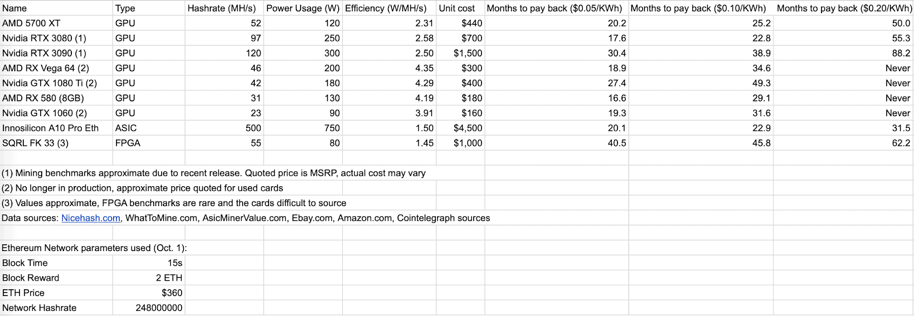

## Khai thác Ethereum là gì?

Khai thác tiền điện tử là một quá trình giải quyết các vấn đề toán học phức tạp. Công cụ khai thác về cơ bản là nền tảng của nhiều mạng tiền điện tử khi họ dành thời gian và sức mạnh tính toán để giải các bài toán đó, cung cấp cái gọi là “bằng chứng công việc” cho mạng, xác minh các giao dịch Ether (ETH). Ethereum, giống như Bitcoin ( BTC ), hiện đang sử dụng quy trình đồng thuận bằng chứng công việc (PoW) và sẽ sớm chuyển sang cơ chế bằng chứng cổ phần (PoS) .

Bên cạnh đó, những người khai thác chịu trách nhiệm tạo mã thông báo Ether mới thông qua quy trình này, vì họ nhận được phần thưởng bằng Ether khi hoàn thành xuất sắc nhiệm vụ PoW.

PoW dựa trên các thuộc tính cơ bản của hàm băm, một phần dữ liệu “được mã hóa” được lấy theo thủ tục từ một số đầu vào tùy ý. Sự khác biệt giữa băm và mã hóa tiêu chuẩn là quá trình chỉ diễn ra theo một chiều.

Cách có ý nghĩa duy nhất để tìm đầu vào nào được sử dụng để tạo ra hàm băm nhất định là cố gắng băm tất cả các kết hợp đầu vào có thể và xem cái nào phù hợp. Điều này còn phức tạp hơn bởi thực tế là những thay đổi nhỏ trong dữ liệu ban đầu sẽ tạo ra những kết quả hoàn toàn khác.

Proof-of-work bắt đầu bằng cách chỉ định một danh sách các giá trị băm mong muốn dựa trên tham số “độ khó”. Những người khai thác phải bắt buộc kết hợp các tham số, bao gồm cả hàm băm của khối trước đó, để tạo ra một hàm băm đáp ứng các điều kiện do độ khó đặt ra. Đây là một nhiệm vụ tốn nhiều năng lượng có thể dễ dàng điều chỉnh bằng cách tăng hoặc giảm độ khó.

Những người khai thác có một “tỷ lệ băm” nhất định xác định số lượng kết hợp mà họ thử trong một giây và càng nhiều người khai thác tham gia thì càng khó tái tạo mạng cho các thực thể bên ngoài. Bằng cách đưa công việc thực sự vào, những người khai thác bảo mật mạng.

Bài viết này sẽ hướng dẫn bạn cách khai thác Ethereum? Các giao dịch Ethereum được khai thác như thế nào? Khai thác ethereum hoạt động như thế nào?

## Tại sao bạn nên khai thác Ethereum?

Khai thác biến hành động bảo mật mạng thành một hoạt động kinh doanh phức tạp nhưng thường khá sinh lãi, vì vậy động lực chính để khai thác là kiếm tiền. Những người khai thác nhận được một phần thưởng nhất định cho mỗi khối, cộng với bất kỳ khoản phí giao dịch nào do người dùng trả. Phí thường đóng góp một phần nhỏ vào tổng doanh thu, mặc dù sự bùng nổ tài chính phi tập trung vào năm 2020 đã giúp thay đổi phương trình đó đối với Ethereum.

Có nhiều lý do khác khiến ai đó muốn khai thác Ethereum. Một thành viên cộng đồng có lòng vị tha có thể quyết định khai thác thua lỗ chỉ để góp phần bảo vệ mạng, vì mỗi hàm băm bổ sung đều có giá trị. Khai thác cũng có thể hữu ích để có được Ether mà không phải đầu tư trực tiếp vào tài sản.

Một cách sử dụng độc đáo để khai thác tại nhà là một hình thức sưởi ấm rẻ hơn. Các thiết bị khai thác biến điện thành tiền điện tử và nhiệt — ngay cả khi tiền điện tử có giá trị thấp hơn chi phí năng lượng, thì bản thân nhiệt có thể hữu ích cho những người sống ở vùng khí hậu lạnh hơn.

### Quá trình chuyển đổi bằng chứng cổ phần sẽ giết chết hoạt động khai thác Ether?

Một mối quan tâm chung đối với bất kỳ công cụ khai thác Ethereum tiềm năng nào là lộ trình Ethereum 2.0, đưa ra các kế hoạch chuyển đổi sang bằng chứng cổ phần, một thuật toán đồng thuận sẽ loại bỏ các công cụ khai thác trong đó tất cả các công cụ khai thác Ethereum hiện có đều có thời gian giới hạn để kiếm tiền lãi từ khoản đầu tư của họ. Nhưng may mắn thay, khai thác PoW có thể vẫn hoạt động cho đến khoảng năm 2023.

Việc ra mắt Ethereum 2.0 Giai đoạn 0, dự kiến ​​vào năm 2020, là một chuỗi khối riêng biệt sẽ không ảnh hưởng đến việc khai thác theo bất kỳ cách nào. Chỉ với Giai đoạn 2, việc khai thác có thể bắt đầu không được chấp nhận, nhưng không có kế hoạch cụ thể nào cho quá trình chuyển đổi đó kể từ tháng 10 năm 2020.

Giai đoạn 2 dự kiến ​​sẽ ra mắt vào khoảng cuối năm 2021 hoặc đầu năm 2022. Nhưng điều đáng nói là Ethereum có một lịch sử lâu dài về sự chậm trễ với lộ trình của nó — trong năm 2017–2018, người ta tin rằng quá trình chuyển đổi sẽ hoàn thành vào khoảng năm 2020 . Không ai thực sự biết khi nào Ethereum 2.0 sẽ kết thúc, nhưng kể từ tháng 10 năm 2020, hầu hết các ước tính cho thấy rằng những người khai thác mới sẽ có đủ thời gian để thu lại ít nhất một phần đáng kể khoản đầu tư của họ vào phần cứng.

## Lợi nhuận khai thác ETH: Khai thác Ethereum có sinh lãi không?

Việc bất kỳ loại khai thác nào có sinh lãi hay không phụ thuộc hoàn toàn vào chi phí điện ở bất kỳ khu vực nhất định nào. Theo quy định, bất cứ thứ gì dưới 0,12 đô la cho mỗi kilowatt tiêu thụ trong một giờ đều có khả năng mang lại lợi nhuận, mặc dù mức giá dưới 0,06 đô la được khuyến nghị để biến việc khai thác trở thành một doanh nghiệp kinh tế thực sự khả thi.

Những con số này sẽ loại bỏ hầu hết các nỗ lực khai thác tại nhà, đặc biệt là ở các nước phát triển nơi [giá điện](https://strom-report.de/electricity-prices-europe/)  thường trên 0,2 đô la. Mặc dù có thể kiếm được lợi nhuận với mức giá như vậy, nhưng lợi tức trên vốn có thể bị ảnh hưởng nghiêm trọng. Ví dụ: một công cụ khai thác có chi phí 3.000 đô la tạo ra doanh thu 200 đô la mỗi tháng và sử dụng 45 đô la tiền điện ở mức 0,05 đô la/kWh sẽ mất 19 tháng để tự hoàn vốn. Công cụ khai thác tương tự được sử dụng trong khu vực có chi phí điện 0,2 USD/KWh sẽ được hoàn trả sau 150 tháng hoặc hơn 12 năm.

Những người khai thác chuyên nghiệp có thể đạt được lợi thế bằng cách chuyển hoạt động của họ sang các khu vực có điện rẻ nhất hoặc bằng cách tận dụng mức giá thường thấp hơn dành cho các ngành công nghiệp. Đây là một số lý do chính tại sao khai thác mỏ đã trở thành một ngành công nghiệp nghiêm túc và thâm dụng vốn.

Nhưng hầu hết mọi người vẫn có thể khai thác Ethereum tại nhà, đặc biệt là vì nó có thể được thực hiện với các card đồ họa tiêu dùng do AMD và Nvidia sản xuất. Đối với những người khai thác Ethereum sống ở những khu vực có giá điện thấp, nó cũng có thể trở thành một nguồn thu nhập lớn.

Có nhiều công cụ tính toán khai thác ETH có thể phác thảo lợi nhuận dự kiến, ví dụ: [Miningbenchmark.net](https://www.miningbenchmark.net/) , [Whattomine](https://whattomine.com/) hoặc [máy tính](https://www.cryptocompare.com/mining/calculator/eth?HashingPower=200&HashingUnit=MH%2Fs&PowerConsumption=140&CostPerkWh=0.12&MiningPoolFee=1) của CryptoCompare . Cũng có thể tính toán các giá trị này một cách độc lập. Công thức được sử dụng bởi các trang web máy tính khá đơn giản:

Điều này cung cấp ước tính về số tiền mà một người khai thác dự kiến ​​​​sẽ kiếm được trong một ngày. Về bản chất, doanh thu của người khai thác là tổng số phát hành của mạng nhân với phần của họ trong tổng tỷ lệ băm của mạng. Để kiếm được lợi nhuận, người ta cần trừ chi phí điện (tức là chi phí khai thác Ethereum) mà người khai thác sử dụng. Ví dụ: một thiết bị sử dụng 1,5 kWh điện với mức giá 0,10 đô la sẽ có giá 3,6 đô la mỗi ngày.

Bạn cũng có thể tìm thấy các giá trị để thêm vào công thức doanh thu trực tuyến. [Etherscan](https://etherscan.io/charts) sẽ cung cấp ước tính cập nhật về tổng tỷ lệ băm, cũng như thời gian tạo khối và phần thưởng khối.

Trên mạng Ethereum, thời gian tạo khối hiện tại là 15 giây, do đó, có 5.760 khối trong một ngày và phần thưởng là 2 ETH cho mỗi khối kể từ tháng 10 năm 2020. Tỷ lệ băm của công cụ khai thác phụ thuộc hoàn toàn vào phần cứng khai thác, trong khi tỷ lệ băm của mạng là tổng của tất cả các công cụ khai thác đóng góp cho mạng.

Chìa khóa để khai thác thành công là tối đa hóa tỷ lệ băm trong khi giảm thiểu chi phí điện và phần cứng. Do đó, ngoài vị trí, việc lựa chọn phần cứng khai thác là rất quan trọng để khai thác.

## Các giao dịch Ethereum được khai thác như thế nào?

Ether được thiết kế như một loại tiền chỉ có thể được khai thác bằng các đơn vị xử lý đồ họa tiêu dùng hoặc GPU. Điều này trái ngược với Bitcoin, thứ chỉ có thể được khai thác hiệu quả với các thiết bị chuyên dụng thường được gọi là máy mạch tích hợp dành riêng cho ứng dụng hoặc ASIC. Các thiết bị này được kết nối cứng để chỉ thực hiện một tác vụ, điều này cho phép chúng đạt được hiệu quả cao hơn nhiều so với phần cứng tính toán thông thường hơn.

Việc tạo ra một thuật toán khai thác “kháng ASIC” về mặt lý thuyết là không thể và cũng rất khó trong thực tế. ASIC được thiết kế cho thuật toán khai thác của Ethereum, Ethash, cuối cùng đã được phát hành vào năm 2018. Tuy nhiên, những công cụ khai thác này mang lại một cải tiến tương đối khiêm tốn so với GPU về hiệu quả băm. Ngược lại, ASIC cho Bitcoin hiệu quả hơn đáng kể so với GPU do các chi tiết cụ thể của thuật toán khai thác của nó.

Một loại thiết bị chuyên dụng khác là FPGA, viết tắt của field-programmable gate array. Đây là nền tảng trung gian giữa ASIC và GPU, cho phép một số dạng cấu hình trong khi vẫn hiệu quả hơn GPU ở các loại tính toán cụ thể.

Có thể khai thác Ethereum bằng tất cả các thiết bị này, nhưng không phải tất cả đều thực tế hoặc hợp lý. Ví dụ, FPGA kém hơn GPU trong hầu hết các trường hợp. Chúng là những thiết bị đắt tiền và rất phức tạp, đòi hỏi kiến ​​thức kỹ thuật tiên tiến để sử dụng hiệu quả. Phần thưởng được cho là không đáng giá, vì hiệu suất khai thác của chúng vẫn rất gần với hiệu suất của các GPU hàng đầu.

Ether ASIC cung cấp khả năng tăng hiệu suất có thể đo lường được so với card đồ họa nhưng lại có nhiều nhược điểm trong sử dụng thực tế. Mối quan tâm quan trọng nhất là ASIC chỉ có thể khai thác Ethereum và một số đồng tiền khác dựa trên cùng một thuật toán băm.

GPU có thể khai thác nhiều đồng tiền khác và, nếu gặp khó khăn, có thể được bán lại cho các game thủ hoặc được sử dụng để xây dựng một PC chơi game. Ngoài ra, ASIC khó tìm nguồn hơn vì ít cửa hàng bán chúng, trong khi mua trực tiếp từ nhà sản xuất có thể yêu cầu số lượng đặt hàng cao và thời gian chờ đợi lâu.

Vì vậy, đối với những người khai thác tại nhà có sở thích, GPU vẫn là lựa chọn hợp lý nhất do tính linh hoạt và hiệu suất tương đối tốt so với giá cả.

## Làm thế nào để tìm phần cứng khai thác tốt nhất?

Việc chọn phần cứng phù hợp chủ yếu phải được quyết định bởi ba yếu tố: tỷ lệ băm tối đa có thể, mức tiêu thụ năng lượng và giá mua của nó.

Giá mua đôi khi bị bỏ qua, nhưng nó có thể tạo ra hoặc phá vỡ hoạt động khai thác vì phần cứng không tồn tại mãi mãi. Hao mòn thành phần là một yếu tố, vì cuối cùng, tất cả các thiết bị sẽ bị lỗi. Tuy nhiên, vấn đề này thường bị thổi phồng quá mức vì GPU là thiết bị khá linh hoạt , với nhiều [báo cáo](https://www.reddit.com/r/EtherMining/comments/fp2bvt/average_lifespan_of_a_graphics_card_whats_the_max/) về việc chúng tiếp tục khai thác trong hơn 5 năm.

Rủi ro đáng kể nhất ảnh hưởng đến thợ đào là phần cứng trở nên lỗi thời. Các GPU hoặc ASIC tiên tiến hơn có thể loại bỏ gần như hoàn toàn các công cụ khai thác hiện có, đặc biệt là những công cụ có chi phí điện cao hơn. Do đó, “thời gian hoàn vốn” — mất bao lâu để người khai thác tự hoàn vốn — trở thành một thước đo rất quan trọng để phân tích tài chính trong khai thác.

Dưới đây là bảng liệt kê các thông số tài chính của phần cứng khai thác Ether hàng đầu:

Bảng phân tích thời gian hoàn vốn trong đó giá trị càng thấp thì kết quả càng tốt. Biện pháp này được chọn do sự khác biệt lớn về tỷ lệ băm giữa các thiết bị, điều này sẽ làm sai lệch so sánh lợi nhuận hàng ngày.

Các tính toán hoàn toàn bỏ qua bất kỳ khoản phí nào được tích lũy, vốn khó đoán hơn nhiều so với phần thưởng khối. Tùy thuộc vào ngày, phí đóng góp 10%–50% tổng doanh thu hàng ngày vào mùa hè năm 2020 , nhưng trong lịch sử, chúng dao động dưới 10%.

Một lưu ý nữa là bảng này được tổng hợp trong một thị trường giá lên cao. Một số cấu hình đã không thể kiếm tiền và bất kỳ sự giảm giá nào của Ether có thể làm trầm trọng thêm tình hình. Nhìn chung, doanh thu của người khai thác dao động mạnh và phép ngoại suy số tiền thu được trong một ngày trong tương lai có thể rất không đáng tin cậy. Những người khai thác cạnh tranh để giành phần thưởng khối với nhau, vì vậy việc giảm chi phí vận hành xuống dưới mức trung bình toàn cầu là chìa khóa cho một doanh nghiệp bền vững.

Cuối cùng, bảng bỏ qua chi phí của phần cứng còn lại cần thiết để lắp ráp một công cụ khai thác. Nó chủ yếu là chi phí cố định và tương đối rẻ, vì các giàn khai thác GPU sử dụng từ 6 đến 14 GPU. ASIC phần lớn là tự cung tự cấp, nhưng nói chung, yêu cầu mua các bộ cấp nguồn bên ngoài.

Với những tuyên bố từ chối trách nhiệm đó, việc so sánh dù sao cũng làm nổi bật một vài điểm khác biệt và nhược điểm của các tùy chọn phần cứng khai thác khác nhau. Ví dụ: AMD RX 580 ba năm tuổi là giá trị tốt nhất cho số tiền bạn bỏ ra ở mức 0,05 đô la cho mỗi kWh. Nhưng hiệu suất năng lượng thấp khiến nó trở thành một lựa chọn yếu hơn nhiều so với các loại khác trong khung chi phí điện cao hơn.

A10 Pro ASIC cho đến nay là lựa chọn hấp dẫn và tiết kiệm năng lượng nhất cho những người khai thác có chi phí điện cao. Các ASIC khác không được đưa vào do quá khó mua hoặc tuổi thọ còn lại ngắn. Nvidia RTX 3080 cũng là một giải pháp thay thế mạnh mẽ toàn diện cho mọi loại công cụ khai thác dựa trên điểm chuẩn sơ bộ.

SQRL FK 33 là một trong những FPGA phổ biến hơn, nhưng mô hình này nêu bật lý do tại sao loại phần cứng này ít được sử dụng. Mặc dù hiệu suất năng lượng cao, đơn giá của nó vẫn khiến nó không hấp dẫn so với tất cả các tùy chọn khác. Tuy nhiên, điều đáng chú ý là con số giá mẫu được lấy từ danh sách eBay của một thiết bị cũ đã được tân trang lại.

Mua các GPU đã qua sử dụng đã hết giá trị như AMD RX Vega 64 hoặc Nvidia GTX 1060 cũng có thể là một biện pháp tiết kiệm chi phí tốt, nhưng người mua có thể gặp rủi ro hỏng hóc thiết bị cao hơn.

## Khai thác Ethereum hoạt động như thế nào: Nguyên tắc và rủi ro

Khai thác đòi hỏi phải lập kế hoạch cẩn thận và chú ý để tránh những kết quả đáng tiếc. Tất cả các máy tính đều có nguy cơ hỏa hoạn tiềm ẩn và nguy cơ này tăng lên trong quá trình khai thác do sử dụng liên tục và tiêu tốn nhiều năng lượng.

Đối với cài đặt khai thác tại nhà, điều quan trọng là không làm quá tải lưới điện trong nước do tiêu thụ điện quá mức. Toàn bộ lưới và mỗi ổ cắm đơn chỉ được xếp hạng cho một công suất tối đa nhất định và các thiết bị khai thác có thể dễ dàng vượt qua các ngưỡng đó. Hệ thống dây điện có thể bị hỏng và quá nóng, gây ra nguy cơ hỏa hoạn ngay lập tức. Tham khảo ý kiến ​​chuyên gia để đánh giá mức độ an toàn của thiết lập của bạn.

Rất nên chọn các bộ cấp nguồn chất lượng cao với biên định mức công suất lớn để bảo vệ khỏi điện áp tăng vọt và các vấn đề về điện khác.

Đối với các thiết bị khai thác GPU và FPGA, có một số yêu cầu phần cứng chính để khai thác Ethereum một cách hiệu quả. Đầu tư vào bo mạch chủ chuyên dụng, chẳng hạn như Asrock X370 Pro BTC+ hoặc Gigabyte GA-B250-FinTech, có thể rất đáng giá, vì chúng được tối ưu hóa để khai thác. Mỗi bo mạch chủ có thể hỗ trợ tối đa 14 GPU, điều thường không thể thực hiện được trên các bo mạch chủ tiêu chuẩn.

Bo mạch chủ phải được ghép nối với đủ dung lượng RAM, 8 hoặc 16 gigabyte và ít nhất 256GB dung lượng ổ đĩa. Phần thứ hai rất quan trọng vì việc khai thác Ethereum yêu cầu rất nhiều bộ nhớ thời gian chạy, ít nhất là 4GB cho mỗi GPU. Thông qua một thủ thuật của hệ điều hành được gọi là bộ nhớ đệm tệp trang, yêu cầu này có thể được chuyển sang bộ lưu trữ vĩnh viễn rẻ hơn nhiều mà không làm giảm hiệu suất. RAM riêng của GPU cũng phải có ít nhất 6GB để tính đến DAG ngày càng tăng, một cơ chế chính của thuật toán Ethash.

DAG, viết tắt của đồ thị theo chu kỳ có hướng, là một bộ dữ liệu lớn được sử dụng để tính toán các giá trị băm để khai thác Ethereum. Phần cứng khai thác phải có đủ dung lượng bộ nhớ để lưu trữ. Bộ dữ liệu tăng trưởng với tốc độ xấp xỉ 1GB cứ sau hai năm đối với Ether, mặc dù các đồng tiền khác có thể có tốc độ tăng trưởng khác nhau. Các thiết bị 4 gigabyte sẽ hoàn toàn không sử dụng được vào cuối năm 2020, trong khi thẻ 6GB có thể sẽ hết giá trị sử dụng vào năm 2024. [Máy tính](https://investoon.com/tools/dag_size) trực tuyến có thể giúp đánh giá lịch trình thời gian chính xác.

Bộ xử lý trung tâm có thể rẻ đến mức cần thiết, vì nó không liên quan đến khai thác GPU. Thiết lập nhiều GPU có khả năng yêu cầu riser, một bộ điều hợp để cho phép GPU được kết nối với bo mạch chủ. Vỏ giàn khai thác phải mở và đủ rộng để không khí lưu thông.

Về mặt hệ điều hành, Windows và Linux đều là các tùy chọn hợp lệ, mặc dù Linux có thể yêu cầu nhiều tương tác dòng lệnh hơn để thiết lập. Điều tối quan trọng là phải tối ưu hóa GPU về tốc độ xung nhịp, mức sử dụng năng lượng và thời gian bộ nhớ để đạt được các số liệu đã nêu trước đó, tuy nhiên, hướng dẫn này không thể tổng hợp đầy đủ.

Cách đơn giản nhất để khai thác ETH là tham gia một trong nhiều nhóm khai thác Ethereum như SparkPool, Nanopool, F2Pool và nhiều nhóm khác. Điều này cho phép những người khai thác có một nguồn thu nhập ổn định thay vì thỉnh thoảng có cơ hội ngẫu nhiên tìm thấy toàn bộ khối. Phần mềm khai thác phổ biến bao gồm Ethminer, Claymore và Phoenix. Có thể đáng để thử nghiệm từng cái để xem cái nào nhanh hơn cho cấu hình cụ thể của bạn.

Cuối cùng, các thiết bị phải được bảo dưỡng, lau chùi và phủi bụi thường xuyên để giữ cho phần cứng luôn ở trạng thái tốt. Có những chi tiết khác liên quan đến việc thiết lập một trang trại khai thác thành công, nhiều trong số đó được bảo vệ cẩn thận dưới dạng bí mật thương mại. Hướng dẫn này không có nghĩa là hoàn toàn toàn diện, nhưng nếu bạn nghiêm túc về việc khai thác, bây giờ bạn sẽ có một nền tảng kiến ​​thức vững chắc để tiến hành nghiên cứu thêm.