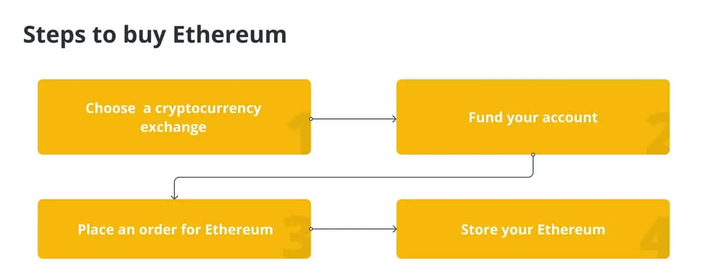

## Định nghĩa Ethereum

Nếu Bitcoin (BTC) được cho là tương lai của tiền tệ, thì Ethereum là gì? Đối với một người mới làm quen với không gian tiền điện tử, đó là câu hỏi hợp lý cần đặt ra, vì họ có thể thấy Ethereum và tiền điện tử Ether ( ETH ) bản địa của nó bên cạnh Bitcoin ở khắp mọi nơi trên các sàn giao dịch và tin tức. Tuy nhiên, thật không công bằng khi coi Ethereum là đối thủ cạnh tranh trực tiếp với Bitcoin. Nó có các mục tiêu, tính năng và thậm chí cả công nghệ khác nhau.

Ethereum là một mạng blockchain phi tập trung được điều khiển bởi tiền tệ Ether cho phép người dùng thực hiện giao dịch, kiếm lợi tức từ số dư của họ thông qua staking, sử dụng và lưu trữ các token không thể trao đổi (NFTs), giao dịch tiền điện tử, chơi trò chơi, sử dụng mạng xã hội và rất nhiều thứ khác.

Nhiều người coi Ethereum là bước tiếp theo của internet. Nếu các nền tảng tập trung như App Store của Apple đại diện cho Web 2.0, thì một mạng phi tập trung do người dùng cung cấp như Ethereum chính là Web 3.0. Ví dụ: “web thế hệ tiếp theo” này hỗ trợ các ứng dụng phi tập trung (DApp), tài chính phi tập trung (DeFi) và trao đổi phi tập trung (DEX).

Hướng dẫn này sẽ cung cấp cho bạn thông tin chi tiết về lịch sử của Ethereum, khai thác ethereum, Ethereum hoạt động như thế nào, cách mua Ethereum, ETH so với BTC, lợi ích của Ethereum và sơ lược về Ethereum 2.0.

## Lịch sử Ethereum

Ethereum không phải lúc nào cũng là dự án chuỗi khối lớn thứ hai trên thế giới. Vitalik Buterin thực sự đã đồng sáng tạo dự án để giải đáp những thiếu sót của Bitcoin. Buterin đã xuất bản sách trắng Ethereum vào năm 2013, mô tả chi tiết các hợp đồng thông minh — các câu lệnh “nếu-thì” tự động bất biến — cho phép phát triển các ứng dụng phi tập trung. Mặc dù sự phát triển DApp đã tồn tại trong không gian blockchain, nhưng các nền tảng không thể tương tác với nhau. Buterin dự định Ethereum sẽ thống nhất chúng. Đối với anh ấy, thống nhất cách DApps chạy và tương tác là cách duy nhất để duy trì việc áp dụng.

Do đó, Ethereum 1.0 đã ra đời. Hãy nghĩ về nó giống như App Store của Apple: một không gian dành cho hàng chục nghìn ứng dụng khác nhau, tất cả đều tuân theo cùng một bộ quy tắc. Chỉ bộ quy tắc đó được mã hóa cứng vào mạng và được thực thi một cách tự động với các nhà phát triển có thể thực thi các quy tắc của riêng họ trong DApps. Không có một đảng trung tâm nào, giống như việc Apple thay đổi và thực thi các quy định. Thay vào đó, quyền lực nằm trong tay của những người hoạt động như một cộng đồng.

Tất nhiên, việc xây dựng một mạng lưới như vậy không hề rẻ. Vì vậy, Buterin và những người đồng sáng lập của anh ấy — Gavin Wood, Jeffrey Wilcke, Charles Hoskinson, Mihai Alisie, Anthony Di Iorio và Amir Chetrit — đã tổ chức một đợt bán trước mã thông báo để huy động 18.439.086 đô la Ether, tài trợ cho sự phát triển hiện tại và tương lai của Ethereum.

Nhóm cũng thành lập Ethereum Foundation tại Thụy Sĩ với sứ mệnh duy trì và phát triển mạng lưới. Ngay sau đó, Buterin tuyên bố rằng quỹ sẽ hoạt động như một tổ chức phi lợi nhuận, điều này khiến một số người đồng sáng lập rời đi.

Theo thời gian, các nhà phát triển đã đến với Ethereum với những ý tưởng phi tập trung của riêng họ. Vào năm 2016, những người dùng này đã thành lập The DAO, một nhóm dân chủ bỏ phiếu về các đề xuất và thay đổi mạng. Tổ chức được hỗ trợ bởi một hợp đồng thông minh và tránh được nhu cầu về một Giám đốc điều hành báo trước quyền lực đối với Ethereum. Thay vào đó, đa số cần phải bỏ phiếu về những thay đổi để chúng được thực hiện.

Tuy nhiên, tất cả đã đi xuống phía nam khi một hacker vô danh đã đánh cắp 40 triệu đô la tiền từ các khoản nắm giữ của The DAO do khai thác bảo mật. Để đảo ngược hành vi trộm cắp, The DAO đã bỏ phiếu cho “hard fork” Ethereum, tách khỏi mạng cũ và nâng cấp lên một giao thức mới, về cơ bản là trải qua một bản cập nhật phần mềm lớn. Phân nhánh mới này vẫn giữ tên Ethereum, trong khi mạng ban đầu tồn tại dưới dạng Ethereum Classic.

## Ethereum hoạt động như thế nào?

Giống như Bitcoin, mạng Ethereum tồn tại trên hàng nghìn máy tính trên toàn thế giới, nhờ người dùng tham gia với tư cách là “nút”, thay vì máy chủ tập trung. Điều này làm cho mạng được phân cấp và có khả năng miễn dịch cao trước các cuộc tấn công, và về cơ bản là không thể ngừng hoạt động. Nếu một máy tính gặp sự cố, điều đó không thành vấn đề vì hàng nghìn máy tính khác đang hỗ trợ mạng.

Ethereum về cơ bản là một hệ thống phi tập trung duy nhất chạy một máy tính có tên là Máy ảo Ethereum (EVM). Mỗi nút giữ một bản sao của máy tính đó, nghĩa là mọi tương tác phải được xác minh để mọi người có thể cập nhật bản sao của họ.

Các tương tác mạng được coi là “giao dịch” và được lưu trữ trong các khối trên chuỗi khối Ethereum. Công cụ khai thác xác thực các khối này trước khi đưa chúng vào mạng và đóng vai trò là lịch sử giao dịch hoặc sổ cái kỹ thuật số. Khai thác để xác minh các giao dịch được gọi là phương pháp đồng thuận bằng chứng công việc (PoW). Mỗi khối có một mã 64 chữ số duy nhất xác định nó. Những người khai thác cam kết sức mạnh máy tính của họ để tìm mã đó, chứng minh rằng nó là duy nhất. Sức mạnh máy tính của họ là “bằng chứng” cho công việc đó và những người khai thác được thưởng bằng ETH cho những nỗ lực của họ.

Ngoài ra, giống như Bitcoin, tất cả các giao dịch Ethereum đều hoàn toàn công khai. Những người khai thác đã phát các khối đã hoàn thành tới phần còn lại của mạng, xác nhận thay đổi và thêm các khối vào bản sao sổ cái của mọi người. Các khối đã được xác nhận không thể bị giả mạo, đóng vai trò là lịch sử hoàn hảo của tất cả các giao dịch mạng.

Nhưng, nếu những người khai thác được trả tiền cho công việc của họ, thì ETH đó đến từ đâu? Mỗi giao dịch đi kèm với một khoản phí, được gọi là “gas”, được trả bởi người dùng bắt đầu giao dịch nói trên. Khoản phí đó được trả cho người khai thác xác thực giao dịch, khuyến khích khai thác trong tương lai và đảm bảo an ninh mạng. Gas về cơ bản đóng vai trò là giới hạn, hạn chế số lượng hành động mà người dùng có thể thực hiện trên mỗi giao dịch. Nó cũng có sẵn để ngăn chặn thư rác mạng.

Bởi vì ETH là một mã thông báo tiện ích hơn là một mã thông báo giá trị, nên nguồn cung của nó là vô hạn. Ether liên tục được đưa vào lưu thông dưới dạng phần thưởng của người khai thác và nó cũng sẽ như vậy với phần thưởng đặt cược khi mạng chuyển sang bằng chứng cổ phần (PoS). Về lý thuyết, Ether sẽ luôn có nhu cầu, có nghĩa là lạm phát sẽ không bao giờ làm giảm giá trị tài sản ngoài giá trị sử dụng.

Thật không may cho nhiều người, phí gas Ethereum có thể khá cao dựa trên hoạt động của mạng. Điều này là do một khối chỉ có thể chứa rất nhiều gas thay đổi tùy theo loại và số lượng giao dịch. Do đó, những người khai thác sẽ chọn các giao dịch có phí gas cao nhất, nghĩa là người dùng đang cạnh tranh để xác thực các giao dịch trước. Sự cạnh tranh này đẩy phí ngày càng cao, làm tắc nghẽn mạng trong thời gian bận rộn.

Nghẽn mạng là một vấn đề nghiêm trọng, mặc dù nó đang được giải quyết trong Ethereum 2.0 — một cuộc đại tu hoàn chỉnh sẽ được thảo luận trong một phần riêng biệt.

Tương tác với Ethereum yêu cầu tiền điện tử, được lưu trữ trong ví. Ví đó kết nối với DApps, hoạt động như một hộ chiếu cho hệ sinh thái Ethereum. Từ đó, bất kỳ ai cũng có thể mua đồ, chơi trò chơi, cho vay tiền và thực hiện mọi loại hoạt động giống như trên internet truyền thống. Chỉ có điều, web truyền thống miễn phí cho người dùng vì họ đang cung cấp thông tin cá nhân. Các thực thể tập trung chạy các trang web sau đó bán dữ liệu đó để kiếm tiền.

Tiền điện tử thay thế dữ liệu ở đây, nghĩa là người dùng có thể tự do duyệt và tương tác ẩn danh. Điều này cũng có nghĩa là việc sử dụng DApp là không phân biệt đối xử. Ví dụ: không DApp cho vay hoặc ngân hàng nào có thể từ chối ai đó dựa trên chủng tộc hoặc tình trạng tài chính của họ. Người trung gian không thể chặn giao dịch mà họ cho là “giao dịch đáng ngờ”. Người dùng kiểm soát những gì họ làm và cách họ làm, đó là lý do tại sao nhiều người coi Ethereum là Web 3.0 — tương lai của tương tác web.

## Ethereum làm gì?

Tài chính phi tập trung được cho là thành tựu lớn nhất của mạng Ethereum. DApps có thể thực hiện một số chức năng trong hệ sinh thái đã xuất hiện vào khoảng năm 2019 đến 2020 và ngày càng trở nên phổ biến. Càng nhiều DApp được sử dụng, kết quả là mạng Ethereum sẽ càng được sử dụng nhiều hơn. Bối cảnh DeFi của Ethereum là bối cảnh lớn nhất hiện có, với các DApp thành công mang lại nhiều nhận thức hơn cho nền tảng trong những năm qua.

Ví dụ, các nghệ sĩ đang kiếm được hàng triệu đô la bằng cách đưa tác phẩm của họ lên chuỗi khối thông qua mã thông báo không thể thay thế hoặc NFT. Người ta có thể thắc mắc, tại sao lại mua tác phẩm nghệ thuật kỹ thuật số khi chúng ta chỉ có thể chụp màn hình nó? Các nhà sưu tập muốn sở hữu, đó là lý do tại sao. NFT cũng giữ bằng chứng về quyền sở hữu và phục vụ như một hình thức lưu trữ an toàn. Về cơ bản, nó là một sản phẩm tất cả trong một dành cho các nhà sưu tập nên không khó để nhận thấy sự hấp dẫn.

Đó cũng là lý do khiến người ta muốn bức “Mona Lisa” gốc hơn là một bản sao, ngay cả khi bản sao không thể phân biệt được với bản đầu tiên. NFT cũng đại diện cho các vật phẩm và phụ kiện có thể sử dụng được trong trò chơi trực tuyến. Người chơi có thể trang trí nhà cửa và nhân vật của mình bằng những tài sản độc đáo từ các nghệ sĩ, mang lại một nguồn thu nhập khác cho quảng cáo.

Các nhà phát triển đã xây dựng các ứng dụng truyền thông xã hội không thể kiểm duyệt, cho phép người dùng mách nước cho nhau về nội dung. Trò chơi cho phép người dùng đầu tư vào tài sản, chơi để phát triển chúng và sau đó bán để kiếm lợi nhuận, rút ​​ra giá trị thực tế từ thời gian chơi trò chơi của họ. Có những nền tảng dự đoán thưởng cho những dự báo chính xác và những nền tảng làm việc tự do không cắt giảm quá nhiều cho mỗi khoản thanh toán.

Tất cả điều này được quản lý tự động thông qua chuỗi khối và hợp đồng thông minh, với DeFi giúp người dùng kiểm soát tiền của họ nhiều hơn bao giờ hết.

## Khai thác Ethereum

Quá trình tạo một khối giao dịch để thêm vào chuỗi khối Ethereum được gọi là khai thác. Ethereum hiện đang sử dụng chuỗi khối bằng chứng công việc nhưng đang chuyển sang bằng chứng cổ phần (PoS) với Ethereum 2.0 cho các mục đích về khả năng mở rộng và cách tiếp cận thân thiện với môi trường hơn .

Công cụ khai thác Ethereum là máy tính chạy phần mềm và sử dụng thời gian cũng như sức mạnh xử lý của chúng để xử lý các giao dịch và tạo khối. Những người tham gia mạng phải đảm bảo rằng mọi người đều đồng ý về trình tự giao dịch trong các hệ thống phi tập trung như Ethereum. Những người khai thác hỗ trợ việc này bằng cách tạo các khối bằng cách giải các câu đố đầy thách thức về mặt tính toán, do đó bảo vệ mạng khỏi những kẻ tấn công.

## Ethereum so với Bitcoin

Trong khi Bitcoin là loại tiền điện tử chính thống nhất, cộng đồng Ethereum có tham vọng mở rộng dự án. Cái trước được coi là tiền kỹ thuật số và nó phục vụ mục đích đó một cách hợp lý. Nhưng Bitcoin có những hạn chế của nó. Đó là một mạng PoW đang gặp khó khăn trong việc mở rộng quy mô, khiến một số người tin rằng đó là một kho lưu trữ giá trị, tương tự như vàng. Bitcoin cũng có giới hạn cứng là 21 triệu đồng xu, càng chứng minh cho lập luận đó.

Mặt khác, Ethereum có ý định vượt qua cơ sở hạ tầng internet hiện tại của chúng ta. Nó có kế hoạch tự động hóa nhiều quy trình vẫn yêu cầu trung gian như sử dụng cửa hàng ứng dụng hoặc làm việc với các nhà quản lý quỹ. ETH được sử dụng nhiều hơn như một cách để tương tác với mạng hơn là một cách để chuyển tiền, mặc dù nó cũng có thể làm điều đó.

Các nhà phát triển có thể xây dựng trên Ethereum để tạo mã thông báo tương thích với Ether duy nhất cho mỗi DApp, được gọi là mã thông báo ERC-20. Mặc dù quy trình không hoàn hảo nhưng điều này có nghĩa là tất cả các mã thông báo dựa trên Ethereum đều có thể tương tác về mặt kỹ thuật. Mạng của Bitcoin chỉ dành cho Bitcoin.

## Ưu điểm của Ethereum

Bên cạnh tính phi tập trung và ẩn danh, Ethereum còn có nhiều lợi ích khác, chẳng hạn như không bị kiểm duyệt. Ví dụ: nếu ai đó tweet điều gì đó xúc phạm, Twitter có thể chọn gỡ nội dung đó xuống và trừng phạt người dùng đó. Tuy nhiên, trên nền tảng truyền thông xã hội dựa trên Ethereum, điều đó chỉ có thể xảy ra nếu cộng đồng bỏ phiếu để làm điều đó. Bằng cách đó, những người dùng có quan điểm khác nhau có thể thảo luận khi họ thấy phù hợp và mọi người có thể quyết định điều gì nên nói và không nên nói.

Các yêu cầu của cộng đồng cũng ngăn cản những kẻ xấu tiếp quản. Một người nào đó có ý định xấu sẽ cần kiểm soát 51% mạng để thực hiện thay đổi, điều này gần như là không thể trong hầu hết các trường hợp. Nó an toàn hơn nhiều so với một máy chủ đơn giản có thể bị đột nhập.

Sau đó, có các hợp đồng thông minh, tự động hóa nhiều bước được thực hiện bởi các cơ quan trung ương trên web truyền thống. Ví dụ, một freelancer trên Upwork phải sử dụng nền tảng này để tìm khách hàng và thiết lập hợp đồng thanh toán. Mô hình kinh doanh của Upwork lấy tỷ lệ phần trăm của mỗi hợp đồng để trả cho nhân viên, chi phí máy chủ, v.v. Trên Web 3.0, khách hàng có thể chỉ cần viết một hợp đồng thông minh có nội dung: “Nếu công việc được hoàn thành vào thời điểm X, tiền sẽ được giải phóng .” Các quy tắc được mã hóa cứng trong hợp đồng và không thể bị can thiệp bởi bất kỳ bên nào sau khi đã viết.

Việc mua Ether cũng trở nên dễ dàng hơn bao giờ hết. Các công ty như PayPal và công ty con Venmo của nó hỗ trợ mua tiền điện tử bằng tiền pháp định ngay trong ứng dụng. Xem xét hàng triệu khách hàng trên mỗi nền tảng, họ chắc chắn sẽ tham gia sớm hơn là muộn.

## Nhược điểm của Ethereum

Mặc dù nghe có vẻ là một nền tảng hoàn hảo nhưng Ethereum có một số vấn đề chính cần được giải quyết.

Đầu tiên là khả năng mở rộng. Buterin đã hình dung ra Ethereum giống như web hiện tại, với hàng triệu người dùng tương tác cùng một lúc. Tuy nhiên, do thuật toán đồng thuận PoW, sự tương tác như vậy bị giới hạn bởi thời gian xác thực khối và phí gas. Hơn nữa, phân cấp là một trở ngại. Một thực thể trung tâm, như Visa, quản lý mọi thứ và đã hoàn thiện quy trình giao dịch.

Thứ hai, có khả năng tiếp cận. Tính đến thời điểm viết bài, Ethereum rất tốn kém để phát triển và khó tương tác với những người dùng chưa quen với công nghệ của nó. Một số nền tảng yêu cầu ví cụ thể, điều đó có nghĩa là một người phải chuyển ETH từ ví hiện tại của họ sang ví được yêu cầu. Đó là một bước không cần thiết đối với người dùng đã ăn sâu vào hệ sinh thái tài chính hiện tại của chúng tôi và không thân thiện với người mới bắt đầu chút nào.

Chắc chắn, PayPal đang thêm hỗ trợ tiền điện tử, nhưng người dùng không thể làm được gì nhiều ngoài việc giữ nó ở đó. Nền tảng cần tích hợp với DeFi và DApps để tăng khả năng truy cập một cách có ý nghĩa.

Nền tảng này có một số tài liệu được viết tốt về vấn đề này — một cách quan trọng khác để thu hút nhiều người dùng hơn. Nhưng hành động thực sự sử dụng Ethereum cần hợp lý hóa. Tìm hiểu về blockchain rất khác so với việc sử dụng nó.

## Ethereum 2.0 (Eth2) là gì?

Ethereum đang dần nâng cấp lên phiên bản 2.0, dự kiến ​​sẽ mang đến thuật toán đồng thuận bằng chứng cổ phần. Được lên kế hoạch hoạt động từ năm 2020 đến năm 2022, mạng Ethereum truyền thống đang nỗ lực hợp nhất với Beacon Chain — tính năng mới đầu tiên của Ethereum 2.0.

Thoạt nhìn Beacon Chain không thay đổi nhiều, nhưng nó bổ sung những thay đổi cơ bản cần thiết cho việc nâng cấp trong tương lai, chẳng hạn như chuỗi phân đoạn. Bạn có nhớ vấn đề về khả năng mở rộng đã thảo luận trước đó không? Chuỗi phân mảnh và quá trình phân mảnh là một phần quan trọng trong việc giải quyết mọi vấn đề về quy mô.

Sharding là hành động truyền bá các giao dịch trên nhiều mạng blockchain nhỏ hơn. Những mạng nhỏ hơn này có thể được điều hành bởi người dùng có phần cứng yếu hơn, vì họ chỉ cần lưu trữ thông tin từ phân đoạn nói trên chứ không phải toàn bộ mạng. Về cơ bản, sharding giúp xác thực Ethereum dễ tiếp cận hơn và giúp giải mã mạng chính.

Ethereum 2.0 khiến nhiều người đam mê tiền điện tử cảm thấy lạc quan. Những người nổi tiếng đang tận dụng lợi thế của NFT và sự gia tăng nhận thức về blockchain nói chung đang tăng lên. Tuy nhiên, tất cả hoạt động này đã dẫn đến phí giao dịch cao và thời gian xác thực chậm hơn, minh họa cho nhu cầu về Ethereum 2.0. Điều này có thể tạo ra một vấn đề, vì phí đôi khi có thể chiếm hơn một nửa số tiền giao dịch. May mắn thay, các nhà phát triển DApp đang nỗ lực làm việc để làm cho nó dễ tiếp cận hơn đối với việc áp dụng chính thống đang chờ xử lý.

Một phần của giải pháp đó nằm ở sự đồng thuận bằng chứng cổ phần, một tính năng cốt lõi của Ethereum 2.0. Thay vì khai thác tốn nhiều năng lượng, Ethereum 2.0 đánh dấu bước chuyển sang thuật toán đồng thuận PoS. Bằng chứng cổ phần thay thế công cụ khai thác bằng trình xác thực: người dùng lưu trữ chuỗi khối Ethereum, xác thực giao dịch và hơn thế nữa. Về cơ bản, chúng là một dạng nút khác.

Để trở thành người xác thực đầy đủ, người ta phải đặt cược tối thiểu 32 ETH, ít nhất là trong giai đoạn đầu của Ethereum 2.0. Bằng cách để một máy tính được kết nối với mạng, những người xác nhận sẽ kiếm được ETH như một phần thưởng cho những nỗ lực của họ. Ý tưởng là những người đặt cược ETH của họ có ý định tốt nhất về mạng và sẽ làm bất cứ điều gì có thể để đảm bảo thành công của nó. Ngoài ra, nếu người xác thực không tham gia hoặc cố gắng làm điều gì đó độc hại, họ có thể mất ETH đã nói.

Đối số cho bằng chứng cổ phần là nó là một hình thức đồng thuận chuỗi khối nhanh hơn, dễ tiếp cận hơn. Nó không yêu cầu phần cứng đặc biệt như khai thác, nghĩa là bất kỳ ai có tiền và thiết bị đều có thể tham gia. Về lý thuyết, khả năng truy cập đó sẽ phát triển mạng. Càng nhiều trình xác thực, càng nhiều khối được xác thực. Trình xác thực bổ sung cũng phân cấp Ethereum nhiều hơn, tăng tính bảo mật khi vai trò được mở rộng.

## Cách mua Ethereum

Bạn sẽ không thể mua tiền điện tử từ ngân hàng hoặc công ty môi giới trực tuyến như Vanguard hoặc Fidelity. Thay vào đó, bạn sẽ cần sử dụng nền tảng giao dịch tiền điện tử. Có rất nhiều trao đổi tiền điện tử có sẵn, từ bảng điều khiển đơn giản đến phức tạp dành cho các nhà giao dịch nâng cao. Các nền tảng khác nhau có giá cả, biện pháp bảo mật và các tính năng khác khác nhau, vì vậy nên thực hiện một số nghiên cứu trước khi đăng ký.

Để mở tài khoản với một sàn giao dịch tiền điện tử, gần như chắc chắn bạn sẽ cần cung cấp một số thông tin cá nhân và xác minh danh tính của mình. Sau đó, bạn sẽ có thể cấp tiền cho tài khoản của mình bằng cách kết nối tài khoản ngân hàng hoặc thẻ ghi nợ của bạn. Các khoản phí rất có thể sẽ khác nhau tùy thuộc vào tùy chọn bạn chọn.

Cấp tiền cho tài khoản của bạn không có nghĩa là bạn đã mua Ethereum và như với bất kỳ tài khoản đầu tư nào, bạn không muốn số tiền chưa đầu tư của mình không hoạt động. Ở giai đoạn này, bạn phải mua Ethereum để đầu tư.

Bạn sẽ có thể giao dịch đô la Mỹ để lấy Ethereum sau khi tài khoản của bạn được lấp đầy. Chỉ cần nhập số tiền bạn muốn đổi lấy Ethereum. Tùy thuộc vào giá của Ethereum và số lượng bạn muốn mua, rất có thể bạn sẽ mua cổ phiếu của một loại tiền tệ Ethereum duy nhất. Giao dịch mua của bạn sẽ được hiển thị dưới dạng phần trăm của tổng số tiền ether.

Việc để khoản đầu tư tiền điện tử của bạn vào tài khoản trao đổi sẽ dễ dàng hơn nếu bạn chỉ có một số lượng nhỏ. Tuy nhiên, nếu bạn muốn chuyển tài sản nắm giữ của mình sang một vị trí lưu trữ an toàn hơn, ví kỹ thuật số có thể cung cấp bảo mật bổ sung. Có rất nhiều loại ví kỹ thuật số, mỗi loại có mức độ bảo vệ khác nhau, chẳng hạn như ví giấy hoặc ví di động.  

## Bạn có nên mua Ethereum?

Ethereum là loại tiền điện tử có giá trị thứ hai theo vốn hóa thị trường và nó được coi là bạc so với vàng của Bitcoin. Giống như bất kỳ khoản đầu tư nào, rủi ro gia tăng của Ethereum tương đương với phần thưởng lớn hơn là điều khả thi. Trong mọi trường hợp, bây giờ không còn là năm 2009 nữa: Ethereum đã vượt qua giai đoạn chứng minh khái niệm và bây giờ là thời điểm để các nhà đầu tư chưa khám phá loại tài sản này trước đây thực hiện điều đó.

Do sự không chắc chắn và biến động của thị trường tiền điện tử, trước khi đầu tư một lượng đáng kể quỹ hưu trí của bạn vào Ethereum hoặc bất kỳ loại tiền điện tử nào khác, hãy tự nghiên cứu. Tuy nhiên, nó có thể đáng được coi là một lựa chọn tăng trưởng tích cực trong một danh mục đầu tư đa dạng. Tất nhiên, đừng đầu tư nhiều hơn số tiền bạn có thể để mất.

## Tương lai của Ethereum

Chuỗi khối Ethereum đã chứng kiến ​​​​sự gia tăng mức độ phổ biến trong những tháng gần đây, khi các nhà phát triển đã sử dụng nó để xây dựng một loạt các dự án tài chính phi tập trung và NFT. Theo những người ủng hộ, sự xuất hiện của các ứng dụng mới như thế này — trong số những ứng dụng đầu tiên chạy trên chuỗi khối công khai — đã gây ra hiệu ứng mạng to lớn khi hoạt động gia tăng thu hút ngày càng nhiều nhà phát triển đến với Ethereum.

Tuy nhiên, các vấn đề cơ bản vẫn là liệu Ethereum, chậm tiến độ với một bộ nâng cấp công nghệ phức tạp, có thể cạnh tranh với các đối thủ nhanh nhẹn hơn hay không và liệu có bất kỳ sự đồng thuận nào về chức năng dài hạn của nó khi thế giới tiền điện tử phát triển hay không.

Ngược lại, các nhà đầu tư như Garg cảnh báo rằng với tầm quan trọng lâu dài của Ethereum, thị trường tiền điện tử có thể chuẩn bị đảo chiều, với việc Bitcoin quay trở lại vị trí thống trị không thể tranh cãi.