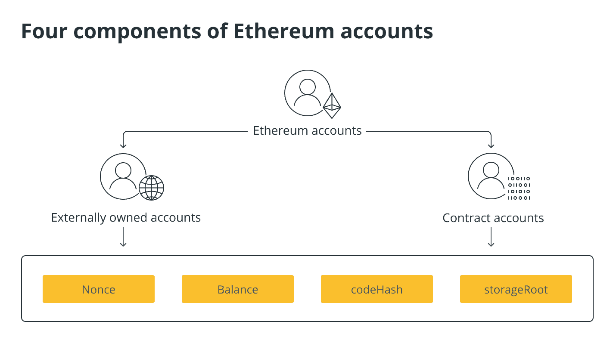

## Ví Ethereum là gì?

Ví Ethereum là một phần mềm hoặc phần cứng cho phép người dùng tương tác với chuỗi khối Ethereum . Ví cho phép người dùng quản lý tài khoản của họ trên mạng Ethereum. Tài khoản Ethereum là một loại tài khoản có thể gửi giao dịch và theo dõi số dư của nó, với bao nhiêu địa chỉ Ethereum tùy thích để gửi và nhận tiền, tạo hợp đồng thông minh, tương tác với các ứng dụng phi tập trung, v.v.

Địa chỉ Ethereum là một chuỗi ký tự và số công khai bắt đầu bằng “0x”. Số dư của mọi địa chỉ Ethereum có thể được nhìn thấy trên chuỗi khối, mặc dù không biết ai kiểm soát địa chỉ nào vì địa chỉ trên mạng được biểu thị thông qua một chuỗi số và chữ cái. Ví là phần mềm hoặc phần cứng cho phép người dùng kiểm soát nhiều địa chỉ nếu cần.

Ví Ethereum được kiểm soát thông qua khóa riêng hoặc “mật khẩu” cho phép người dùng chuyển tiền trong ví. Những khóa riêng tư này chỉ được biết bởi người tạo ví, vì bất kỳ ai biết chúng đều có thể truy cập vào tiền của họ.

Có một số loại ví Ethereum để lựa chọn, bao gồm một số loại được giữ trên máy tính để bàn hoặc thiết bị di động của bạn và một số được giữ ngoại tuyến thông qua một mảnh giấy, titan hoặc phần cứng.

Đây là mọi thứ bạn cần biết về cách chọn ví Ethereum và tìm hiểu cách tốt nhất để lưu trữ Ethereum.

## Hiểu về ví Ethereum

Ví Ethereum có đủ hình dạng và kích cỡ, nhưng không phải tất cả chúng đều có các tính năng giống nhau. Một số ví chỉ cho phép người dùng gửi Ether ( ETH) giữa các địa chỉ, trong khi những ví khác có nhiều chức năng hơn và thậm chí cho phép người dùng tạo hợp đồng thông minh, là những thỏa thuận tự thực hiện được viết bằng mã.

Việc thiết lập ví Ethereum thường liên quan đến việc tải xuống hoặc ghi lại khóa riêng hoặc cụm từ hạt giống. Khóa riêng cho phép người dùng gửi hoặc chi tiêu tiền điện tử của họ và cụm từ hạt giống cho phép họ truy cập vào ví của họ và tất cả các khóa riêng trong ví. Khóa cá nhân hoặc cụm từ hạt giống rất quan trọng để bảo đảm tiền và ví tiền điện tử hoạt động như một trình quản lý mật khẩu cho việc nắm giữ tiền điện tử của người dùng. Miễn là người dùng biết mật khẩu chính của họ (cụm từ gốc), họ có thể truy cập vào quỹ tiền điện tử của mình.

Lưu trữ khóa riêng bằng các chương trình của bên thứ ba, chẳng hạn như ứng dụng, có vẻ như là một giải pháp thay thế dễ dàng, nhưng những kẻ độc hại có thể truy cập các dịch vụ này nếu thiết bị của người dùng bị xâm phạm vì quyền truy cập vào khóa đồng nghĩa với việc truy cập vào tiền.

Có hai loại tài khoản Ethereum chính: tài khoản thuộc sở hữu bên ngoài (EOA) và tài khoản hợp đồng. Các tài khoản thuộc sở hữu bên ngoài được tạo thành từ các cặp khóa mật mã công khai và riêng tư. Khóa công khai và khóa riêng ngăn chặn giả mạo bằng cách chứng minh rằng người gửi thực sự đã ký một giao dịch. Bởi vì người dùng sử dụng khóa riêng của họ để ký các giao dịch, nên nó cho phép họ kiểm soát số tiền trong tài khoản của mình.

Người dùng chỉ có khóa riêng (trong khi không bao giờ thực sự nắm giữ tiền điện tử), vì vậy tiền luôn nằm trên sổ cái của Ethereum. Sổ cái Ethereum là một hệ thống lưu giữ hồ sơ theo dõi ẩn danh danh tính của các cá nhân, số dư ETH và hồ sơ về tất cả các giao dịch hợp lệ giữa những người tham gia mạng.

Trong các tài khoản hợp đồng, một hợp đồng thông minh được triển khai trên mạng. Mỗi hợp đồng thông minh có một địa chỉ Ethereum duy nhất được kiểm soát bởi mã.

Bất chấp những khác biệt ở trên, cả hai loại tài khoản Ethereum đều có bốn đặc điểm chung: nonce, balance, codeHash và storageRoot, như được liệt kê bên dưới:

- Nonce: Đối với các tài khoản thuộc sở hữu bên ngoài, số này biểu thị số lượng giao dịch được gửi từ địa chỉ của tài khoản. Đối với tài khoản hợp đồng, nonce là số lượng hợp đồng được tạo bởi tài khoản.

- Số dư: Địa chỉ ETH này sở hữu một số Wei nhất định (đơn vị mệnh giá ETH), với 1e+18 Wei (ký hiệu số mũ) trên mỗi ETH. 1e+18 Wei có nghĩa là 1 ETH tương đương với 1x1018 Wei.

- codeHash: Băm này đại diện cho mã của một tài khoản trên Máy ảo Ethereum (EVM). Máy tính ảo riêng của Ethereum, được gọi là EVM, là một phần của giao thức thực sự thực hiện xử lý giao dịch. Trường codeHash cho EOA là hàm băm của văn bản trống. Đối với tài khoản hợp đồng, mã được băm và lưu trữ dưới dạng codeHash.
    
- storageRoot: Hàm băm này là nút gốc của cây Merkle Patricia (cây gồm các hàm băm). Cây này, trống theo mặc định, mã hóa hàm băm của nội dung lưu trữ của tài khoản ETH.
    
  

### Các nút đầy đủ và các nút ánh sáng

Tương tự như ví Bitcoin , ví Ethereum có thể được gọi là ứng dụng khách hoặc nút nhẹ hoặc nút đầy đủ, với cái sau yêu cầu người dùng tải xuống toàn bộ chuỗi khối trên thiết bị của họ và cái trước là một ứng dụng nhỏ. Chạy một nút đầy đủ cho phép người dùng xác minh các giao dịch trên mạng thay vì lấy dữ liệu về những gì diễn ra trong chuỗi khối từ những người khác, nhưng tiêu tốn nhiều tài nguyên tính toán hơn như không gian lưu trữ và bộ nhớ truy cập ngẫu nhiên (RAM) do kích thước của chuỗi khối.

Các nút đầy đủ cho phép mạng [duy trì](https://www.ethernodes.org/) tính phi tập trung và có thể chạy qua một số ứng dụng khách Ethereum chính, còn được gọi là phần mềm cho phép các nút chạy chuỗi khối Ethereum.

Các nút đầy đủ thường được sử dụng bởi những người dùng Ethereum có kinh nghiệm hơn, những người cam kết hơn với mạng. Đối với những người dùng ít kinh nghiệm hơn, một nút nhẹ không yêu cầu họ phân bổ các tài nguyên tính toán quan trọng có thể có ý nghĩa hơn.

Các nút nhẹ yêu cầu ít không gian hơn và có thể dễ dàng chạy trên các thiết bị có ít sức mạnh tính toán hơn như điện thoại thông minh. Vì các nút nhẹ không chứa một bản sao đầy đủ của chuỗi khối nên chúng cần các nút đầy đủ để lấy thông tin đó và xác minh toàn bộ trạng thái của hệ thống trong các tiêu đề khối. Tiêu đề khối là các phần của các khối được khai thác trên chuỗi khối có chứa thông tin về chính khối đó. Kết nối này diễn ra liền mạch trong nền, cải thiện đáng kể trải nghiệm người dùng.

### Ví nóng và lạnh

Trong lĩnh vực tiền điện tử, có hai loại ví chính: nóng và lạnh. Ví nóng là những ví được lưu trữ trên các thiết bị được kết nối với internet, chẳng hạn như máy tính để bàn hoặc máy Mac và thiết bị di động.

Mặt khác, ví lạnh lưu trữ khóa cá nhân của người dùng ngoại tuyến. Ngoại tuyến giúp loại bỏ một số điểm tấn công mà tin tặc có thể lợi dụng, chẳng hạn như lây nhiễm phần mềm độc hại vào thiết bị của người khác để truy cập khóa của họ. Phần mềm độc hại là phần mềm được thiết kế để gây thiệt hại hoặc giành quyền truy cập trái phép.

Ví nóng thường thân thiện với người dùng hơn và cho phép người dùng truy cập tiền của họ mọi lúc, mọi nơi. Mặt khác, ví lạnh thường ít trực quan hơn và có thể khiến việc chuyển tiền của bạn khó khăn hơn một chút.

Do những lo ngại về bảo mật, người dùng nên giữ phần lớn tiền điện tử ngoại tuyến của họ trong ví lạnh, trong khi chỉ chuyển những gì họ cần để đáp ứng các nghĩa vụ ngắn hạn trong ví nóng.

Quá trình lưu trữ ngoại tuyến hầu hết các loại tiền điện tử trong ví lạnh có thể tương tự như những gì đã phổ biến với tiền tệ fiat. Tài khoản ngân hàng và két an toàn an toàn hơn và mọi người dựa vào chúng để cất giữ tiền tiết kiệm (giống như ví lạnh). Và cũng giống như với tài khoản séc, tiền điện tử mà mọi người mang theo cho các giao dịch hàng ngày nên được giữ trong ví nóng.

## Các loại ví Ethereum

Một số sử dụng trao đổi tiền điện tử và các dịch vụ khác bao gồm thị trường và dịch vụ cho vay được cung cấp bởi ví để người dùng lưu trữ Ethereum của họ. Chúng được gọi là ví lưu ký, là ví giữ khóa cá nhân của người dùng cho họ. Những điều này có sự đánh đổi vì dịch vụ kiểm soát các khóa riêng của ví và cho phép người dùng truy cập vào số tiền trong đó thay vì người dùng trực tiếp kiểm soát tiền.

Lưu trữ tiền với bên thứ ba thông qua ví lưu ký làm tăng rủi ro đối tác — nguy cơ một bên khác không thực hiện được nghĩa vụ của họ. Ví dụ: dịch vụ giữ khóa riêng có thể bị tấn công hoặc lừa đảo.

Để tận dụng tối đa các ứng dụng phi tập trung (DApps) được xây dựng trên Ethereum, người dùng cần có quyền truy cập vào khóa riêng của họ. Các ứng dụng phi tập trung là các ứng dụng kỹ thuật số chạy trên chuỗi khối.

Các ví khác nhau có thể hữu ích cho các loại người dùng khác nhau. Hầu hết các ví chỉ cho phép người dùng gửi và nhận Ethereum hoặc mã thông báo được xây dựng trên mạng bằng tiêu chuẩn ERC-20. Tiêu chuẩn mã thông báo ERC-20 xác định danh sách các quy tắc phát hành mã thông báo trên mạng Ethereum. Tuy nhiên, không phải tất cả các ví Ethereum đều có chung tính năng.

Một số ví Ethereum có thể được kết nối với thẻ tín dụng hoặc thẻ ghi nợ để cho phép người dùng mua tiền điện tử trực tiếp vào ví của họ. Các tính năng khác bao gồm cho phép người dùng giữ mã thông báo không thể thay thế(NFT), là tài sản mã hóa trên chuỗi khối với dữ liệu nhận dạng duy nhất. Ví dụ, trong khi Ether có thể thay thế được vì 1 ETH sẽ luôn có giá trị bằng 1 ETH, không có hai NFT nào giống nhau.

Với ví Ethereum, cũng có thể sử dụng DApp hoặc các chương trình kỹ thuật số trên chuỗi khối. Các nền tảng truyền thông xã hội, trò chơi, thị trường và nền tảng dịch vụ tài chính đã được xây dựng trên Ethereum và các chuỗi khối khác. Ví Ethereum có trình duyệt tích hợp tương thích với DApps cho phép người dùng truy cập trực tiếp vào chúng.

Ví Ethereum cũng giúp mua tiền điện tử trực tiếp dễ dàng hơn bằng cách cho phép người dùng kết nối tài khoản ngân hàng của họ. Chuyển khoản tài khoản ngân hàng thường tính phí thấp hơn và giúp mua và bán tiền điện tử dễ dàng hơn thông qua thanh toán định kỳ.

Để tăng cường bảo mật, ví Ethereum có thể cho phép người dùng chọn địa chỉ để chuyển tiền của họ. Nếu bất kỳ ai cố gắng chuyển tiền đến một địa chỉ không có trong danh sách, giao dịch sẽ bị chặn. Tài khoản Ethereum cũng có thể cung cấp các tài khoản đa chữ ký (multisig) yêu cầu nhiều hơn một chữ ký để chuyển tiền. Tài khoản nhiều chữ ký phổ biến trong một số nền tảng chuỗi khối và thậm chí trong hệ thống tài chính truyền thống.

Một số ví có một số tính năng được mô tả ở trên, trong khi những ví khác chỉ có một. Các ví tiên tiến hơn thậm chí còn cho phép người dùng giữ Ethereum, mã thông báo ERC-20 và các loại tiền điện tử khác để khám phá các ứng dụng phi tập trung trên các mạng khác nhau.

Điều đáng nói là bạn không cần phải chọn một trong số tất cả các ví Ethereum có sẵn. Khóa riêng cung cấp cho bạn quyền truy cập vào ví của mình, có thể được truy cập qua điện thoại di động, máy tính để bàn, trình duyệt hoặc ở dạng in như ví giấy cùng một lúc.

Giao diện được sử dụng để kết nối với chuỗi khối Ethereum thay đổi, nhưng địa chỉ, giao dịch và dữ liệu khác vẫn giữ nguyên, tương tự như cách mà các trình duyệt khác nhau có thể được sử dụng để truy cập cùng một trang web. Tuy nhiên, hạn chế mức độ tiếp xúc của bạn bằng cách chỉ sử dụng một loại ví có thể tốt hơn để đảm bảo rằng tiền của bạn được an toàn.

### ví di động

Ví di động là các nút nhẹ không yêu cầu người dùng tải xuống toàn bộ chuỗi khối. Ví di động là ứng dụng có thể được cài đặt trên thiết bị di động dễ dàng như bất kỳ ứng dụng nào khác từ App Store của Apple hoặc Google Play và có thể được sử dụng để truy cập tiền của bạn bằng kết nối di động.

Họ dựa vào các công cụ khai thác để chuyển tiếp thông tin chính xác về trạng thái hiện tại của mạng. Một trong những nhược điểm của ví di động là dễ bị hack và nếu thiết bị di động của bạn bị mất, bạn có thể mất quyền truy cập vào quỹ Ethereum của mình. Tuy nhiên, việc có các bản sao lưu có thể giúp bạn an toàn trước bất kỳ tổn thất nào phát sinh do bị hack hoặc vô tình làm mất chìa khóa của bạn.

Hầu hết các ví di động phổ biến đều hỗ trợ mã thông báo Ethereum và ERC-20, đồng thời đi kèm với trình duyệt tích hợp sẵn sàng tương tác với các ứng dụng phi tập trung và lĩnh vực tài chính phi tập trung (DeFi), được xây dựng từ các ứng dụng phi tập trung cung cấp dịch vụ tài chính.

### ví máy tính để bàn

Ví máy tính để bàn chạy trên các hệ điều hành (HĐH) như macOS, Microsoft Windows hoặc Linux OS. Ví máy tính để bàn lý tưởng cho những người thích quản lý tài chính của họ trên máy tính để bàn. Vì hầu hết các ví máy tính để bàn đều giữ khóa cục bộ nên người dùng sẽ cần sử dụng máy tính để truy cập ví Ethereum của họ.

Người dùng có thể sử dụng ứng dụng khách nhẹ hoặc tải xuống ứng dụng khách đầy đủ với toàn bộ chuỗi khối Ethereum bằng các ví như vậy. Tải xuống một ứng dụng khách đầy đủ được coi là một giải pháp thay thế thích hợp hơn vì nó giúp loại bỏ nhu cầu của những người khai thác cung cấp dữ liệu chính xác cho họ. Thay vào đó, chúng tự xác thực các giao dịch, dẫn đến tăng cường bảo mật.

Tương tự như ví di động, ví máy tính để bàn không chỉ cho phép người dùng gửi và nhận Ethereum mà còn có thể cung cấp một số tính năng nâng cao để cho phép người dùng tạo hợp đồng thông minh hoặc chạy một nút đầy đủ, mang lại cho người dùng nhiều chức năng hơn trong ví của họ một cách hiệu quả.

Vì ví máy tính để bàn được kết nối với internet nên chúng được coi là ví nóng. Các khóa riêng của các ví này được lưu trữ trên máy của người dùng chứ không phải trên bất kỳ máy chủ bên ngoài nào, khiến chúng dễ bị hack.

### giao diện web

Ví giao diện web là một giải pháp thay thế phổ biến cho cả ví di động và máy tính để bàn và về cơ bản là các trang web cho phép người dùng tương tác với chuỗi khối Ethereum sau khi kết nối ví của họ với giao diện.

Ví web cho phép người dùng sử dụng trình duyệt web để kết nối với tài khoản của họ. Những ví này tận dụng lợi thế của lưu trữ đám mây và có thể được truy cập từ mọi nơi trên thế giới. Lưu trữ đám mây sử dụng các máy chủ khổng lồ được đặt trong các trung tâm dữ liệu lưu trữ dữ liệu trên thực tế và giúp khách hàng có thể truy cập dữ liệu đó qua internet. Dữ liệu được lưu trữ có thể được cung cấp theo yêu cầu với dung lượng và chi phí đúng lúc, loại bỏ nhu cầu mua và quản lý thiết bị lưu trữ dữ liệu.

Sử dụng trực tiếp ví giao diện web có thể gặp rủi ro vì người dùng phải tin tưởng một trang web bằng khóa riêng của họ. Mặc dù một số giao diện web được coi là đáng tin cậy, nhưng người dùng vẫn có thể dễ bị tấn công bởi một số cuộc tấn công không liên quan đến ví.

Các cuộc tấn công này bao gồm các âm mưu lừa đảo trong đó tin tặc có thể truy cập vào một trang web mạo danh giao diện web hợp pháp. Tương tự, các cuộc tấn công hệ thống tên miền (DNS) có thể xảy ra khi hoạt động trên Internet của người dùng được chuyển hướng đến một máy chủ độc hại sử dụng dữ liệu đã thu thập như thông tin đăng nhập để truy cập thông tin của họ.

### tiện ích mở rộng trình duyệt

Tiện ích mở rộng trình duyệt được sử dụng trên trình duyệt máy tính để bàn để tương tác với các ứng dụng phi tập trung và có thể lưu trữ cả mã thông báo ETH và ERC-20, đồng thời hỗ trợ số lượng địa chỉ gần như vô hạn. Đối với những người dùng cao cấp hơn, ví trình duyệt cũng hữu ích vì chúng có thể được sử dụng để tương tác với các chuỗi khối khác.

Tiện ích mở rộng trình duyệt được coi là giải pháp thay thế an toàn hơn cho giao diện web vì chúng lưu trữ khóa cá nhân của người dùng trên trình duyệt của họ theo cách được mã hóa. Để truy cập ví của họ, người dùng sẽ cần bảo vệ chúng bằng mật khẩu để tăng cường bảo mật.

Giống như ví di động, việc cài đặt tiện ích mở rộng trình duyệt rất dễ dàng và được thực hiện giống như cách người dùng cài đặt bất kỳ tiện ích mở rộng trình duyệt nào khác. Một số trình duyệt đã đi kèm với ví Ethereum tích hợp giúp việc tương tác với DApps trở nên dễ dàng hơn.

### ví phần cứng

Ví phần cứng là phần cứng lưu trữ khóa cá nhân của người dùng ngoại tuyến và là ví lạnh. Ví phần cứng phải được kết nối với máy tính để chuyển tiền và được bảo vệ bằng mật khẩu hoặc mã PIN.

Để có quyền truy cập vào các khoản tiền, một bên độc hại sẽ cần quyền truy cập vật lý vào thiết bị và biết mật khẩu bảo vệ các khoản tiền. Tuy nhiên, ví phần cứng có thể đắt đối với người dùng có số tiền nhỏ để lưu trữ.

Điều quan trọng là không bao giờ mua ví phần cứng đã qua sử dụng cũng như không mua ví từ nhà cung cấp bên thứ ba. Sau khi được sử dụng lần đầu tiên, những ví này có thể bị xâm phạm để lừa người dùng tin rằng họ đang gửi tiền vào ví mà chỉ họ kiểm soát, trong khi chủ sở hữu ban đầu của ví phần cứng có thể đã có quyền truy cập vào ví đó.

### ví giấy

Ví giấy là một loại ví lạnh cơ bản hơn và về cơ bản liên quan đến việc in ra các khóa riêng kiểm soát tiền trên một tờ giấy và lưu trữ nó. Để truy cập vào các khoản tiền, các tác nhân độc hại sẽ cần quyền truy cập vào mảnh giấy đó. Ưu điểm chính của loại ví này là khả năng truy cập của nó, vì tất cả những gì cần thiết là một cây bút và một mảnh giấy.

Do tính chất dễ vỡ của vật liệu in chúng, những chiếc ví này có thể không phù hợp để giữ lâu dài, vì đã có trường hợp giấy bị hỏnghoặc bị ném nhầm ra ngoài. Các lựa chọn thay thế bao gồm các mảng titan đắt tiền thậm chí có thể chống lại các thảm họa thiên nhiên nhờ vật liệu làm nên chúng.

## Cấp tiền cho ví ETH của bạn

Sau khi chọn ví Ethereum để sử dụng và khám phá mạng, cần phải thêm tiền vào đó. Để tương tác với các ứng dụng phi tập trung trên Ethereum, người dùng sẽ cần Ether, tiền điện tử gốc của mạng được sử dụng để thanh toán cho các giao dịch.

Ether có thể được mua trên các sàn giao dịch tập trung và rút về ví của người dùng. Làm như vậy sẽ liên quan đến việc gửi tiền đến một địa chỉ ví công khai, có thể được coi là tương đương với số tài khoản ngân hàng quốc tế (IBAN) được sử dụng trong hệ thống tài chính truyền thống.

Mọi giao dịch trên Ethereum đều phải chịu một khoản phí giao dịch được trả cho những người xác thực mạng, những người giúp duy trì tính toàn vẹn của nó. Số tiền phí có thể thay đổi tùy theo nhu cầu về không gian khối trên chuỗi khối. Không gian khối đề cập đến lượng không gian có sẵn trong mỗi khối dữ liệu được thêm vào mạng. Ví phần mềm cung cấp ước tính phí để giúp người dùng tránh trả quá nhiều bằng cách ước tính phí giao dịch mạng theo nhu cầu mới nhất về không gian khối.

Điều đáng chú ý là các EOA giao tiếp với nhau và với các hợp đồng thông minh thông qua tin nhắn. Thuật ngữ giao dịch đề cập đến một gói dữ liệu đã ký lưu trữ một tin nhắn, tin nhắn này có thể được gửi giữa các tài khoản. Những thông tin liên lạc này được “gói” trong các giao dịch được tài trợ bằng Ether.

Hợp đồng cũng có thể gửi tin nhắn đến các hợp đồng khác. Để điều này xảy ra, một giao dịch tạo hợp đồng mới trước tiên phải xảy ra để sau đó hợp đồng có thể được kích hoạt.

## Giữ ETH của bạn an toàn

Người dùng thường không lo lắng về mức độ an toàn của tiền của họ khi chúng được lưu trữ trong tài khoản ngân hàng, họ cũng không lo lắng về việc bên thứ ba truy cập vào tài khoản ngân hàng của họ và rút tiền mà không được phép.

Khi nói đến ví Ethereum và ví tiền điện tử khác nói chung, các tình huống nêu trên có thể xảy ra và tránh chúng là điều cơ bản để bảo vệ tiền. Cộng đồng Ethereum khuyến nghị người dùng nên kiểm tra ba lần mọi thứ để đảm bảo họ luôn gửi tiền đến đúng địa chỉ, luôn tương tác với các ứng dụng mà họ dự định và ghi lại khóa cá nhân khi cần.

Đánh dấu ví web của bạn và các trang web của bất kỳ ứng dụng phi tập trung nào mà bạn thường xuyên sử dụng cũng là một phương pháp hay nhất được biết đến để giúp tránh các âm mưu lừa đảo. Một số ví tiện ích mở rộng của trình duyệt có danh sách các mưu đồ lừa đảo đã biết và sẽ tự động chặn các trang web không mong muốn để bảo vệ người dùng.

Khi xử lý các giao thức DeFi, điều quan trọng là luôn tìm hiểu xem dịch vụ đó có hợp pháp và đã được kiểm toán hay không để đảm bảo rằng các chuyên gia bảo mật đã xem xét mã của nó. Để tìm hiểu, chỉ cần tìm kiếm trên web tên của dịch vụ và từ “kiểm toán” hoặc “đánh giá”.

Cuối cùng, hãy nhớ rằng nếu nó có vẻ quá tốt để trở thành sự thật, thì có lẽ là như vậy. Những kẻ lừa đảo thường chiếm quyền điều khiển các tài khoản mạng xã hội đã được xác minh để quảng cáo các trò lừa đảo tặng quà giả và các kế hoạch khác để lừa người dùng gửi Ethereum cho họ. Tránh những kế hoạch như vậy chỉ đơn giản là bỏ qua những gì có vẻ quá tốt để trở thành sự thật và thực hiện nghiên cứu của riêng bạn về các dự án mới hơn.

## Bạn nên đặt cược ETH của mình trên Coinbase hay Binance?

Coinbase cho phép bạn mua mã thông báo Ethereum trực tiếp, giúp việc mua và đặt cược ETH của bạn tại một điểm trở nên đơn giản. Có thể mua mã thông báo Ether theo cách tương tự như cổ phiếu: với lệnh thị trường hoặc lệnh giới hạn. Tuy nhiên, các chuỗi phân đoạn phải được phát triển đầy đủ trước khi có thể đổi ETH. Điều này có nghĩa là ETH của bạn sẽ được đặt cược cho đến khi kết thúc giai đoạn một của ETH 2.0 .

Mặt khác, Binance mã hóa Binance Ethereum (BETH) cho người dùng, đại diện cho số ETH đã đặt cọc của bạn trên cơ sở 1:1. Điều này cho phép bạn tiếp tục giao dịch và rút tài sản bị khóa của mình.

Bất kể bạn đặt cược ETH ở đâu, giá trị đồng xu của bạn sẽ tăng hoặc giảm dựa trên giá thị trường trên hầu hết các nền tảng đặt cược.

## Giữ Ethereum có phải là một ý tưởng hay không?

Nếu bạn đang tìm cách đa dạng hóa danh mục đầu tư của mình bằng cách sử dụng các tài sản ngoài Bitcoin, bạn có thể muốn xem xét Ether. Tuy nhiên, vì thị trường tiền điện tử rất biến động và không được kiểm soát, bạn phải đầu tư thận trọng.

Do đó, đầu tư vào Ethereum chỉ là một quyết định sáng suốt nếu bạn có thể đầu tư cẩn thận, sử dụng các biện pháp quản lý rủi ro nghiêm ngặt và giao dịch để kiếm lợi nhuận ngắn hạn. Nếu bạn là nhà đầu tư dài hạn, bạn có thể nắm giữ ETH từ sáu tháng đến một năm hoặc lâu hơn để gặt hái những lợi ích từ sự tăng trưởng giá trị của ETH theo thời gian. Tuy nhiên, hãy lưu ý rằng không có gì là không thể tránh khỏi trong một thị trường đầy biến động và bạn không nên đầu tư nhiều hơn số tiền bạn có thể để mất.