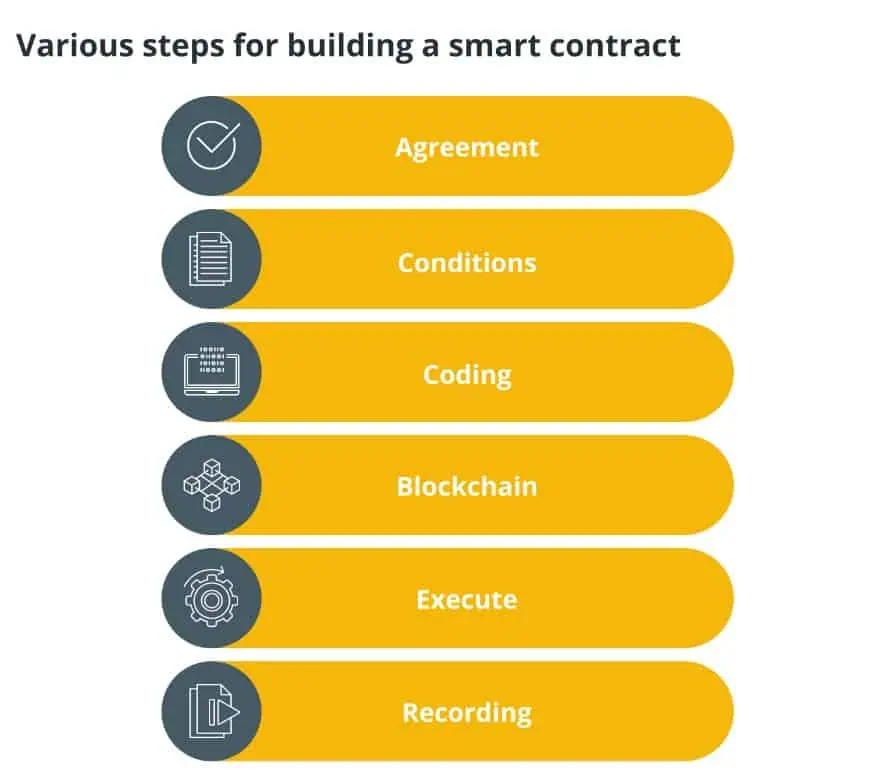
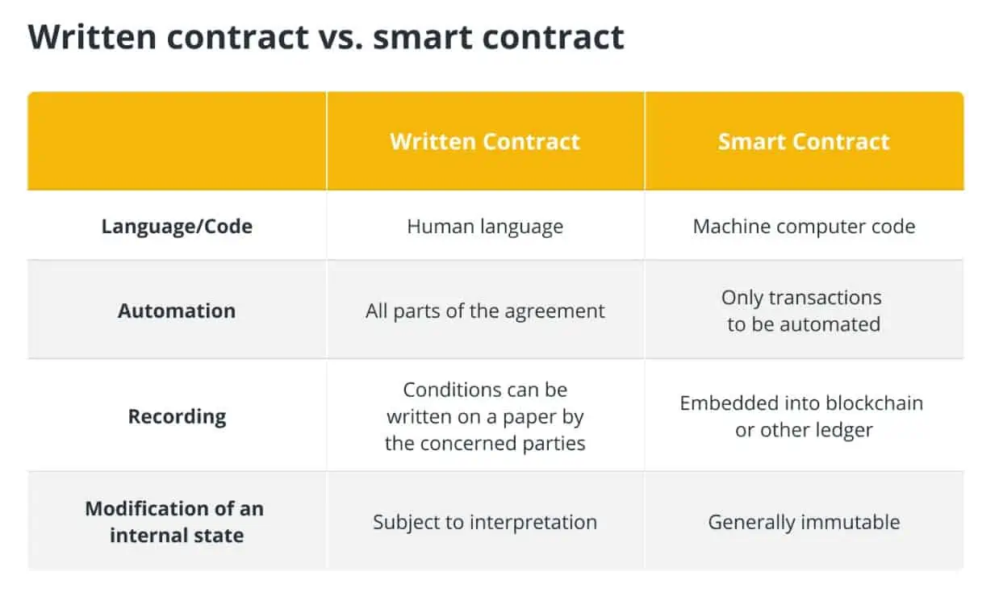

## Smart contract là gì?

Smart contract (hợp đồng thông minh) chỉ đơn giản là một chương trình chạy trên chuỗi khối Ethereum. Đó là một tập hợp mã (chức năng của nó) và dữ liệu (trạng thái của nó) cư trú tại một địa chỉ cụ thể trên chuỗi khối Ethereum.

Vì vậy, một hợp đồng được thực hiện là gì? Hợp đồng đã ký thiết lập mối liên hệ hợp đồng giữa hai hoặc nhiều bên được gọi là hợp đồng được thực thi. Mỗi bên hứa sẽ duy trì các nghĩa vụ pháp lý mà họ đã đồng ý trong văn bản thỏa thuận sau khi hợp đồng được ký kết hợp lệ. Được phổ biến bởi chuỗi khối phổ biến thứ hai thế giới, Ethereum ( ETH ), các Smart contract đã dẫn đến mảng ứng dụng phi tập trung (DApp) và các trường hợp sử dụng khác của mạng.

Một lợi ích chính của mạng chuỗi khối là tự động hóa các tác vụ mà theo truyền thống yêu cầu bên trung gian thứ ba. Ví dụ: thay vì cần ngân hàng phê duyệt chuyển tiền từ khách hàng sang freelancer, quá trình này có thể diễn ra tự động nhờ Smart contract. Tất cả những gì cần thiết là hai bên đồng ý về một khái niệm.

Một ví dụ khác có thể là một nhóm quy định và các công dân mà nhóm đại diện đang tranh luận về một đạo luật. Nếu hai bên này đi đến một thỏa thuận trong một hệ thống dựa trên chuỗi khối, thì luật sẽ được đưa ra thông qua một thỏa thuận được thực thi. Có lẽ người dùng có thể đọc về luật mới thông qua DApp hợp pháp hoặc tương tác với nó theo cách khác dựa trên chuỗi khối.

Bài viết này sẽ thông báo cho độc giả về lịch sử của Smart contract, cách thức hoạt động của Smart contract và tại sao Smart contract lại quan trọng.

## Smart contract hoạt động như thế nào?

Hãy coi Smart contract là câu lệnh “nếu-thì” kỹ thuật số giữa hai (hoặc nhiều) bên. Nếu nhu cầu của một nhóm được đáp ứng, thì thỏa thuận có thể được tôn trọng và hợp đồng được coi là hoàn thành.

Giả sử thị trường yêu cầu một nông dân mua 100 bắp ngô. Cái trước sẽ khóa tiền vào một Smart contract mà sau đó có thể được phê duyệt khi cái sau giao hàng. Khi người nông dân thực hiện nghĩa vụ của mình, tiền sẽ được giải ngân ngay lập tức (tức là sau khi hoàn thành hợp đồng pháp lý). Tuy nhiên, hợp đồng bị hủy bỏ và tiền sẽ được trả lại cho khách hàng nếu người nông dân bỏ lỡ thời hạn của họ.

Tất nhiên, ở trên là một trường hợp sử dụng nhỏ. Smart contract có thể được lập trình để hoạt động cho số đông, thay thế các nhiệm vụ của chính phủ và hệ thống bán lẻ, cùng với các lợi ích khác. Hơn nữa, Smart contract có khả năng loại bỏ nhu cầu đưa những bất đồng nhất định ra tòa, tiết kiệm cả thời gian và tiền bạc cho các bên.

Bảo mật này phần lớn là do mã Smart contract cơ bản. Ví dụ, trên Ethereum, các hợp đồng được viết bằng ngôn ngữ lập trình Solidity của nó , đó là ngôn ngữ hoàn chỉnh của Turing. Điều này có nghĩa là các quy tắc và giới hạn của Smart contract được tích hợp vào mã của mạng và không kẻ xấu nào có thể thao túng các quy tắc đó. Lý tưởng nhất là những hạn chế này sẽ giảm thiểu lừa đảo hoặc thay đổi hợp đồng ẩn. Các Smart contract tiền điện tử chỉ có thể áp dụng nếu tất cả những người tham gia đồng ý và ký tên vào vấn đề này. Sau đó, nó được thiết lập cho cuộc sống.

Về mặt kỹ thuật hơn, ý tưởng về một Smart contract có thể được chia thành một vài bước. Đầu tiên, một Smart contract cần có sự thỏa thuận giữa hai hoặc nhiều bên. Sau khi được thiết lập, cả hai có thể đồng ý về các điều kiện trong đó Smart contract sẽ được coi là hoàn thành. Quyết định sẽ được ghi vào Smart contract, sau đó được mã hóa và lưu trữ trong mạng chuỗi khối.

Sau khi hợp đồng hoàn tất, giao dịch được ghi lại trên chuỗi khối giống như bất kỳ giao dịch nào khác. Sau đó, tất cả các nút sẽ cập nhật bản sao chuỗi khối của chúng với giao dịch này, cập nhật “trạng thái” mới của mạng.

Bây giờ, bạn có thể tự hỏi liệu Bitcoin ( BTC ) và các mạng khác có thể sử dụng Smart contract hay không. Đến một điểm, vâng. Mỗi giao dịch BTC về mặt kỹ thuật là một phiên bản đơn giản hóa của Smart contract và các giải pháp lớp hai như mạng sét đã được phát triển để mở rộng chức năng của mạng. Điều đó nói rằng, việc sử dụng Smart contract của Ethereum là một trường hợp đặc biệt.

Không giống như hầu hết các mạng chuỗi khối được mô tả là sổ cái phân tán, Ethereum là thứ được coi là máy trạng thái phân tán, chứa cái được gọi là Máy ảo Ethereum (EVM) . Trạng thái máy này, mà tất cả các nút Ethereum đồng ý giữ một bản sao, lưu trữ mã Smart contract và các quy tắc mà các hợp đồng này phải tuân theo. Vì mọi nút đều có các quy tắc được đưa vào thông qua mã, nên tất cả các Smart contract của Ethereum đều có những hạn chế giống nhau.

Ngoài những điều trên, hơn 200 Smart contract đã được liệt kê trên trình khám phá chuỗi khối Cardano ([ADA](https://docs.cardano.org/new-to-cardano/what-is-a-smart-contract) ) vào tháng 9 năm 2021 . Smart contract ADA được triển khai bằng các ngôn ngữ lập trình có tên là Marlowe, Plutus và Glow.

Cũng cần lưu ý rằng Smart contract khác với hợp đồng bằng văn bản theo nhiều cách, như được thảo luận trong bảng dưới đây:

## Bối cảnh lịch sử của Smart contract

Tin hay không thì tùy, Smart contract đã có trước công nghệ chuỗi khối từ lâu. Trong khi Ethereum, được giới thiệu vào năm 2014, là triển khai giao thức phổ biến nhất, nhà mật mã học Nick Szabo đã thiết lập ý tưởng này vào những năm 1990.

Trước đó, Szabo đã khái niệm hóa một loại tiền kỹ thuật số có tên là Bit Gold. Mặc dù tài sản chưa bao giờ thực sự được ra mắt, nhưng tiền thân Bitcoin này đã nêu bật trường hợp sử dụng Smart contract — các giao dịch không tin cậy trên internet. Nếu bản thân Web 1.0 là internet và Web 2.0 là sự hiện diện của các nền tảng tập trung, thì Web 3.0 là phiên bản không gian kỹ thuật số không tin cậy, tự động, do người dùng cung cấp.

Nhiều người, bao gồm cả trang web Ethereum, [so sánh](https://ethereum.org/en/developers/docs/smart-contracts/) các Smart contract với một máy bán hàng tự động. Máy bán hàng tự động phục vụ mục đích của một nhà cung cấp cung cấp cho người dùng một sản phẩm mà không cần một người thực sự nhận tiền và bàn giao mặt hàng đó. Smart contract phục vụ mục đích tương tự nhưng linh hoạt hơn nhiều.

Smart contract đã tiến bộ khá nhiều theo thời gian. Chúng bắt đầu bằng những câu lệnh if-then đơn giản mà một lập trình viên có thể tạo và thực hiện. Tuy nhiên, những người có kiến ​​thức lập trình còn hạn chế, tập trung hóa các hợp đồng “không đáng tin cậy” này. May mắn thay, chính những nhà phát triển đó đang làm việc để giải quyết các vấn đề về khả năng tiếp cận.

Kể từ khi thành lập, các nhà phát triển đã làm cho nó có thể thực hiện các Smart contract mà không cần kiến ​​thức về mã hóa. Họ đang tăng cường bảo mật bằng các ngôn ngữ lập trình khác nhau, tạo ra các lựa chọn thay thế như hợp đồng bí mật và thiết kế các cách để tự động lưu trữ lịch sử Smart contract ở định dạng mà con người có thể đọc được — dễ dàng hơn nhiều so với việc sử dụng chuỗi khối để đọc.

## Lợi ích của Smart contract

Các chuỗi khối Smart contract cung cấp nhiều lợi ích khác nhau, bao gồm tốc độ, hiệu quả, độ chính xác, độ tin cậy, tính minh bạch, bảo mật, tiết kiệm, như được thảo luận trong các phần bên dưới.

Smart contract sử dụng các giao thức máy tính để tự động hóa các hành động, tiết kiệm hàng giờ trong các quy trình thương mại khác nhau. Các thỏa thuận tự động làm giảm khả năng thao túng của bên thứ ba bằng cách loại bỏ yêu cầu đối với các nhà môi giới hoặc các bên trung gian khác để phê chuẩn các hợp đồng pháp lý đã ký kết.

Hơn nữa, việc thiếu một trung gian trong Smart contract giúp tiết kiệm tiền. Ngoài ra, tất cả các bên liên quan đều có khả năng hiển thị và truy cập đầy đủ vào các điều khoản và điều kiện của các hợp đồng này. Do đó, không có cách nào để rút lui một khi hợp đồng được ký kết. Điều này đảm bảo rằng giao dịch hoàn toàn minh bạch cho tất cả các bên liên quan.

Hơn nữa, tất cả các tài liệu được lưu trữ trên chuỗi khối đều được sao chép nhiều lần, cho phép khôi phục bản gốc trong trường hợp mất dữ liệu. Smart contract được mã hóa và mật mã bảo vệ tất cả các tài liệu khỏi bị giả mạo. Cuối cùng, Smart contract cũng loại bỏ các lỗi xảy ra do điền thủ công vào một số biểu mẫu.

## Các trường hợp và ứng dụng sử dụng Smart contract

Ngoài ví dụ thanh toán được đề cập ở trên, còn có nhiều cách triển khai Smart contract tiềm năng khác nhau có thể tự động hóa thế giới và biến nó thành một nơi dễ sống hơn. Dưới đây là một số ví dụ nổi bật về các trường hợp sử dụng Smart contract.

### nhận dạng kỹ thuật số

Trên internet, thông tin là tiền tệ. Các công ty thu lợi từ việc biết sở thích của mọi người và mọi người không phải lúc nào cũng kiểm soát được cách thu thập dữ liệu đó, họ cũng không thu được lợi nhuận từ nó. Với Smart contract, mọi người có quyền kiểm soát.

Trong một tương lai dựa trên blockchain, danh tính sẽ được mã hóa. Lý tưởng nhất là điều này có nghĩa là danh tính của mỗi người tồn tại trên một chuỗi khối phi tập trung, an toàn và bảo mật khỏi bất kỳ tác nhân xấu nào. Giờ đây, nếu người dùng muốn tham gia trên phương tiện truyền thông xã hội hoặc gửi tài liệu tới ngân hàng cho mục đích vay tiền, họ có thể kiếm lợi từ cái trước và kiểm soát quá trình giao dịch trong cái sau.

Đối với phương tiện truyền thông xã hội, không có trung gian nào kiểm soát mạng. Thay vào đó, người dùng chọn thông tin nào sẽ công khai và thông tin nào sẽ giữ kín. Nếu họ muốn tham gia trao đổi thông tin, chẳng hạn như chứng thực, họ có thể tạo Smart contract và chọn dữ liệu nào được giao dịch, thay vì chỉ lấy mọi thứ về người dùng. Bên thứ ba không ở đó để lấy một số tiền hoặc bí mật lưu trữ và bán dữ liệu đó — chỉ người dùng mới thu được lợi nhuận.

Điều tương tự cũng áp dụng khi giao dịch với ngân hàng và các tổ chức tài chính khác. Giao tiếp chỉ liên quan đến việc gửi các tài liệu cần thiết và thông tin quan trọng. Không có nguy cơ một nhóm cho vay lưu trữ địa chỉ email của bạn và bán nó cho các công ty tín dụng khác. Thông tin đó hoàn toàn nằm dưới sự kiểm soát của người dùng.

### Địa ốc

Trong thế giới truyền thống, môi giới bất động sản là một tội ác cần thiết. Xem xét hành động bán nhà không có gì là dài và phức tạp, chủ sở hữu sẽ thuê một nhà môi giới để quản lý các phần khó hiểu cho họ, chẳng hạn như thủ tục giấy tờ và tìm người mua. Mặc dù điều đó nghe có vẻ lý tưởng đối với người bán, nhưng hãy nhớ rằng các nhà môi giới phải trả một khoản phí đáng kể cho giá bán căn nhà.

Một Smart contract có thể thay thế cho một nhà môi giới, đơn giản hóa quy trình chuyển nhượng nhà trong khi vẫn đảm bảo nó an toàn như với một bên trung gian. Đây là lúc biệt danh “không tin cậy” phát huy tác dụng.

Hãy tưởng tượng chứng thư cho ngôi nhà của bạn được mã hóa trên chuỗi khối Ethereum. Nếu bạn đã sẵn sàng bán nó, bạn sẽ tạo một Smart contract với người mua. Hợp đồng đó sẽ giữ chứng thư trong tài khoản ký quỹ cho đến khi tiền của người mua được nộp đúng cách. Sau đó, và chỉ sau đó, nó sẽ được phát hành.

Mọi người đều thắng. Người bán tiết kiệm tiền vì họ không phải trả tiền trung gian và người mua nhận được nhà sớm hơn nhiều so với những cách khác.

### Bảo hiểm

Chính sách bảo hiểm có thể dễ dàng hưởng lợi từ các Smart contract. Về cơ bản, việc đăng ký một chính sách sẽ đưa người dùng vào một Smart contract với nhà cung cấp. Tất cả các yêu cầu chính sách sẽ được ghi vào Smart contract mà người dùng sẽ đọc và ký nếu họ đồng ý.

Hợp đồng đó sẽ được mở cho đến khi bên chịu trách nhiệm cần nó. Sau đó, họ chỉ cần tải lên các biểu mẫu cần thiết chứng minh nhu cầu thanh toán bảo hiểm của họ và tiền sẽ được giải phóng. Loại hợp đồng này loại bỏ nhu cầu giao tiếp với các nhóm và cá nhân bảo hiểm. Mặc dù người dùng vẫn cần giấy tờ để chứng minh các yêu cầu của họ, nhưng quá trình gửi và tài trợ tiếp theo sẽ gần như ngay lập tức.

Ở khía cạnh nhận dạng của mọi thứ, điều đáng ghi nhớ là tất cả các tài xế sẽ có hồ sơ báo cáo tai nạn và thông tin bảo hiểm quan trọng khác. Khả năng tiếp cận này có thể dẫn đến mức giá thấp hơn cho những người lái xe giỏi không có lịch sử lái xe của họ.

### Chuỗi cung ứng

Có thể cho rằng, một trong những triển khai phổ biến nhất của công nghệ chuỗi khối và Smart contract, đặc biệt, nằm trong chuỗi cung ứng.

Các cửa hàng tạp hóa, nhà kho văn phòng, nông dân và nhiều hơn nữa đều có vị trí cụ thể trong chuỗi cung ứng. Tuy nhiên, với mức độ phức tạp của các mạng này, các công ty ngày càng gặp khó khăn hơn trong việc theo dõi việc lưu ký sản phẩm và theo dõi các khoản thanh toán, trong số những thứ khác. Smart contract có thể tự động hóa và khuyến khích tất cả các bộ phận của chuỗi cung ứng tăng trách nhiệm giải trình của họ.

Ví dụ: giả sử một cửa hàng tạp hóa đang chờ vận chuyển táo từ lục địa khác. Nó đã thanh toán cho một số lượng táo nhất định và mong đợi số lượng hoặc khối lượng chính xác đó khi truy xuất. Tuy nhiên, lỗi của con người có thể có hiệu lực. Ở đâu đó trên đường đi, những người công nhân có thể đã đặt nhầm một số quả táo, lấy trộm chúng khỏi dây chuyền hoặc đơn giản là nói dối về việc tất cả đều đến đích. Một bên làm điều này sẽ làm rối tung phần còn lại của chuỗi, và vào thời điểm một cửa hàng tạp hóa nhận được lô hàng của họ, ai biết nó đã sai ở đâu.

Với Smart contract, cửa hàng tạp hóa có thể thiết lập đăng ký tự động ở mỗi bước của quy trình. Mặc dù những lần đăng ký đó đã tồn tại trong chuỗi cung ứng thông thường, nhưng chúng phải được thực hiện thủ công. Một người có thể phải đếm các đồ vật và gửi những gì đã đến. Họ có thể nói dối và lấy một số sản phẩm, cho rằng một số đã bị thất lạc trên đường đi. Trộm cắp chuỗi cung ứng là một vấn đề lớn, [khiến người Mỹ thiệt hại 35 tỷ đô la mỗi năm](https://americangloballogistics.com/what-you-need-to-know-about-supply-chain-theft/) .

Điều khác biệt với Smart contract là khía cạnh không tin cậy. Cửa hàng có thể đặt nó để thanh toán không được phát hành cho đến khi tất cả số táo được tính. Không có cách nào để đánh lừa hệ thống này, vì vậy các bên sẽ chú ý hơn nhiều khi cung cấp. Ngoài ra, khoản thanh toán sẽ được chuyển ngay lập tức cho bên nhận, đây là một động lực tuyệt vời theo đúng nghĩa của nó.

Ngoài ra, cửa hàng có thể theo dõi Smart contract nào không được thực hiện và chọn không làm việc với các bên đó. Cuối cùng, có thể có một mạng lưới đánh giá toàn bộ những khách hàng phù hợp nhất để làm việc cùng và những khách hàng không phù hợp, giúp tiết kiệm thời gian và tiền bạc cho mọi người về lâu dài.

## Những thách thức chính mà Smart contract phải đối mặt là gì?

Mặc dù Smart contract là một khái niệm tuyệt vời, nhưng chúng chắc chắn không hoàn hảo. Thứ nhất, cần nhớ rằng các Smart contract và mạng chuỗi khối được lập trình thủ công. Lỗi của con người luôn có thể xảy ra và lỗi đó có thể dẫn đến khai thác. Đây chính xác là những gì đã xảy ra với cuộc tấn công vào tổ chức tự trị phi tập trung (DAO) của Ethereum vào năm 2016. Tin tặc đã khai thác một lỗ hổng trong Smart contract gây quỹ của DAO và sử dụng nó để lấy tiền từ dự án.

Đó là chưa kể đến sự thiếu rõ ràng về quy định khi nói đến các thỏa thuận tự trị này. Mặc dù ý tưởng về một quy trình chuyển tiền hợp lý, an toàn nghe có vẻ tuyệt vời trên lý thuyết, nhưng vẫn còn vấn đề về thuế và sự tham gia khác của chính phủ cần xem xét. Người dùng có thể muốn có toàn quyền kiểm soát dữ liệu của họ, nhưng làm thế nào để các bên chính phủ có được thứ họ cần?

Ngoài ra, Smart contract không thể lấy thông tin bên ngoài mạng mà chúng tồn tại. Ít nhất, không phải trong tình trạng hiện tại của họ. Nói cách khác, bạn không thể tải dữ liệu từ một trang web hiện có lên Smart contract trên Ethereum. Điều đó nói rằng, có một cách giải quyết trong oracles — các nút ngoài chuỗi lấy thông tin từ internet và làm cho nó tương thích với các mạng chuỗi khối. Cuối cùng, khi các cơ sở dữ liệu chuyển sang chuỗi khối, các nhà tiên tri có khả năng sẽ tham gia để đóng một vai trò trong việc biến điều đó thành hiện thực.

Ngoài ra, có một vấn đề về khả năng mở rộng lâu dài. Kể từ khi thành lập, các mạng blockchain có xu hướng gặp khó khăn về quy mô, có nghĩa là các giao dịch có thể mất vài phút - nếu không muốn nói là hàng giờ - dựa trên hoạt động. Mặc dù ban đầu đây có thể là một vấn đề, nhưng đó là điều mà các dự án như Ethereum 2.0 đang tìm cách giải quyết . Ngoài ra, một giao dịch mất vài giờ vẫn nhanh hơn nhiều so với số ngày cần thiết để chuyển tiền truyền thống.

## Tương lai của Smart contract

Các hợp đồng dựa trên yêu cầu thông minh chắc chắn là con đường phía trước cho các hợp đồng tương đối cơ bản có thể được viết và thực hiện tự động bất cứ khi nào các điều kiện tiên quyết được đáp ứng, chẳng hạn như trong vận chuyển dân cư, trong đó các khoản tiền hoàn thành có thể được trao ngay sau khi hợp đồng được ký kết.

Các nền tảng Smart contract khác nhau sẽ tiết kiệm thời gian và tiền bạc cho các doanh nghiệp trên toàn thế giới đồng thời cách mạng hóa cách họ tương tác trong chuỗi cung ứng và với khách hàng của họ. Do đó, sự tham gia tối thiểu của con người sẽ giải phóng các cá nhân và những người ra quyết định quan trọng khỏi việc đối phó với công việc quản lý thông thường và quan liêu, cho phép họ tập trung vào công việc hàng ngày của mình. Đó là bởi vì Smart contract tiếp quản sự chậm chạp.

Smart contract đã được nhiều ngân hàng và tổ chức bảo hiểm sử dụng trong hoạt động hàng ngày của họ. Do đó, các Smart contract đã sẵn sàng và đang được thử nghiệm trong các tình huống thực tế, và sẽ không lâu nữa chúng sẽ trở thành một phần trong cuộc sống và thói quen hàng ngày của chúng ta. Bất kể lập luận trước đó là gì, vẫn còn một chặng đường dài phía trước cho đến khi mọi thứ được điều chỉnh bởi một Smart contract, nếu có.